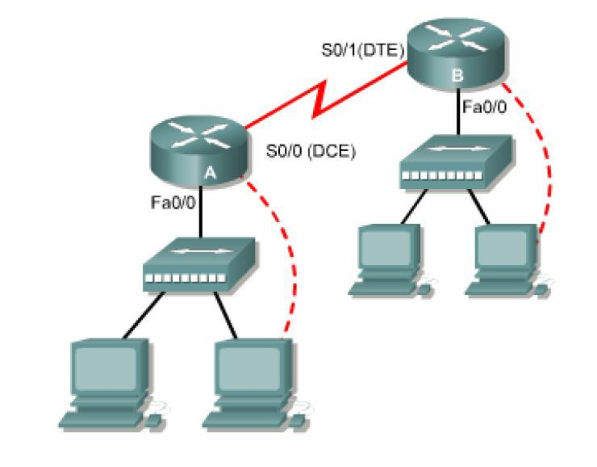

# Network Basic

## 1. What is Network?

* Computer를 연결하는 것
* Network의 장점 : 정보교환 및 소통
  * 하드웨어 공유
  * 컴퓨터간에 파일및 디텍터리 공유
  * 전자 메일 등 커뮤니케이션 지원
  * 전자 뉴스나 www에 의한 정보의 공유
  * 그룹웨어를 이용한 사내 협업 작성
  * 원격지에서 비디오 화상회의 시스템의 사용
* Peer to Peer
  * 10명 내외의 작은 기업에서 모든 컴퓨터가 모두 동일한 level로 연결
  * Printer 공유해서 사용할 수 있는 것을 예로 들 수 있음
* Client/Server
  * 100명 이상의 큰 기업에서 사용하는 방식
  * Server, FTP, SQL, ERP 등의 Server를 구성하여 공유할 내용을 Server에 두고 공유
  * Client : Service Request
  * Server(ex : NOS, Linux) : Response

## 2. Network and Networking

* Data Networking Solutions
  * Local-Area Networks (LAN) : Private Network, 회사 내부 Network에서 Router까지
  * Wide-Area Networks (WAN) : Public Network, 인터넷 망, Router 밖의 Network
    * Router들 끼리 모여 망을 이루어 WAN을 형성
  
* Gateway 주소 = 라우터의 IP주소
  * 서버에 Gateway 주소를 빼버리면 내부망에서만 서비스를 제공하고 외부로 데이터가 보내지지 않음
  * 외부로 통하려면 Gateway 필수
  
* Network 구조
  

  * 많은 수의 PC들이 Switch에 연결됨
    * Switch는 12포트, 24포트, 48포트 등 여러개의 pc를 연결할 수 있음
  * 여러개의 Switch가 Router로 연결되고 Router 들끼리 연결되어 Network함
    * Router는 포트 수도 적고 비싸서 pc를 각각 Router에 연결하는 것은 비효율적

## 3. Azure Network Service

### 1. Networking

* NSG : Network Security Group

* ARM : Azure Resource Management

  * 방화벽, Disk, Memory 등이 OS 또는 VM 안에 포함된 것이 아니라 VM 밖에서 attached되는 Service이다.

* 방화벽 - VMscalnsg

  * Outbound rule은 관리하지 않음
  * Inbound rule을 관리함

* Protocol - TCP

  ​                - UDP

     - 둘 다면 any

* 방화벽에서 priority 숫자가 낮을수록 우선순위가 높다.

* Web Service를 제공하기위해서 Web Server 생성이 필요함

* Web으로 접속하기위한 port를 열어주어야함.

>1. VM server로 들어가기
>2. Server manager 들어가기
>3. Manage 선택
>4. Add roles and features
>5. Next 하면서 넘어가다가 Feature 선택하는 부분에서 Web Server (IIS) 선택
>6. Install

* IIS (Internet Information Server) : MS의 webserver를 IIS라 부름 / 3가지 서버가 존재
  * Web server
  * FTP server
  * SMTP server

* Apache & NGINX : Linux & Unix 의 Web Server which is Free
  * Apache를 많이 사용했지만 NGINX가 보안도 더 좋으면서 성능이 잘나와 바뀌는 추세

## 3. OSI 7 Layer

* OSI 7 Layer : TCP/IP 이후 다양한 회사의 제품들이 상호 통신할 수 있도록 하기 위해 만들어진 표준 규격
* L1 ~ L7까지 총 7개의 층으로 구성되어있음
* Hub나 Bridge는 거의 쓰지 않음
* Switch - L2 개념, Gateway - L7 개념
* Advanced Switch - L4 개념 Switch => 스위치 + 라우터 + 방화벽 >> 많은 기능 but 비쌈

1. Physical Layer : Cable 등 직접적인 연결 도구
2. Data Link Layer : Physical Addressing  > Mac 주소(실제 데이터를 주고받기 위해서 필요), ex, Switch
3. Network Layer : Router에 해당되는 부분, 목적지를 찾는 부분
4. Transport Layer : TCP, UDP 등이 해당됨
   1.  TCP : 신뢰성 있는 데이터 - 3 Way Hand Shake : 데이터를 보내고 잘 받았는지 3번 확인하는 작업을 거침.
   2.  UDP : 비신뢰성 데이터 전송 - 데이터를 보내고 끝, 확인작업이 없음
5. Session Layer : 사용자들 간의 연결하는 부분
6. Presentation Layer : 암호화 및 압축하는 부분
7. Application Layer :  실제 사용하는 부분

* Load Balancer : Client Request를 여러 VM으로 분산시켜줌

  1. Azure Load Balancer (L4 layer load balancer)

     * Internal or internet-facing
     * Basic SKU : 100VM, Single subnet
     * Standard SKU : 1000VM, combination of standalone VMs, Multiple Subnets
     * 같은 Data Center 내의 VM들 사이에서만 부하 분산을 해줄 수 있음

  2. Application Gateway (L7 Layer load balancer)

     * 다른 Data Center 간의 VM끼리도 부하 분산 가능

  3. Traffic Manager (DNS-based, L7)

     * Internet facing

     * Any public IP address with a DNS name, DNS를 기반으로한 트래픽 분산

## 4. Encapsulation / De-Encapsulation

Source				: 데이터 보내는 쪽, 오른쪽 컴퓨터에서 왼쪾 컴퓨터로 1G의 데이터를 보낸다고 하자.

Application    	: 데이터를 보냄

Presentation	 :  Application에서 받은 데이터를 암호화 & 압축한다.

Session			  :  A와 B 연결 설정, Data를 잘게 쪼개도록함, 1번 2번 3번 4번 ..... 여러개로 데이터를 쪼갬

Transport		  : 쪼개진 데이터 앞에 Network Header를 붙임 / TCP인지 UDP인지 등

Network			: 위의 데이터에 Source IP와 Destination IP를 앞에 붙임

Data Link		  : 앞에 Mac 주소에 관련된 Header를 붙여줌

Physical			: LAN카드가 위에서 만든 디지털신호를 전기신호로 바꾸어 보내주는 역할을 함  

Data를 흘려 보내기 위한 전체 과정을 Encapsulation 이라고 한다.

받은 Physical Data를 다시 해석해 나가면서 요청한 데이터를 원상복구 하는 작업을 De-Encapsulation이라 한다.

* Names for Data at Each Laye
  * Application - Presentation - Session : Data
  * Transport Layer : Segments
  * Network Layer : Packets
  * Data Link Layer : Frames
  * Physical Layer : Bits

## 5. IP Address

* IP Address : 인터넷 상에서 목적지를 찾는 주소 체계, 8.8.8.8  8bits 옥텟
  * IPv4 - 32 bits = 2^32 -> 43억개
  * IPv6 - 128 bits = 2^128 -> 340 언데실리온
  * IP = Network ID + Host ID
    * Network ID : ISP에서 부여하는 IP주소
    * Host ID : 각 회사 네트워크 관리자가 부여
* Subnet Mast : Network ID를 식별
* 데이터 전송 방식
  1. Unicast 	1:1 통신
  2. Multicast  1: 그룹 통신(ex, 인터넷 방송)
  3. Broadcast 1: 모든 통신(라우터 까지)
     * D class IP를 사용
     * 그 회사 Network라우터 안의 모든 장비들에 뿌려줌
     * 일반적으로 LAN카드에서 목적지가 자신의 주소인 것만 받고 나머지는 Drop 시킨다. 하지만 Broadcast를 통해 오는 정보는 무조건 CPU로 올림
     * Broadcast가 많이 발생되면 Network 내의 전체 PC 성능 저하를 일으킬 수 있음
     * Router 까지만 가고 그 안으로 넘어가지 못함, 라우터까지가 Broadcast 주소

### 0. TCP/IP : 인터넷 표준 통신 Protocol 

* Protocol : 컴퓨터간에 정보를 주고받을 때의 통신방법에 대한 규칙과 약속
* Dynamic Configuration (자동구성, 유동IP) : DHCP Server에서 할당받아옴, Client OS에 적합
* Static Configuration (수동구성, 고정IP) : IP, Subnet Mask, Gateway, DNS 등을 수동으로 넣어 구성, 서버의 경우 절때 IP가 바뀌면 안됨, Server OS에 적합

* Port : 데이터가 전송 되는 통로 (0 ~ 65,536)
  * 0번과 65,536번은 사용하지 않는다.
  * 1 ~ 1024 : 잘 알려진 포트
    * TCP 21 : FTP : 파일을 주고 받을 때
    * TCP 22 : SSH        => 원격관리할 때 ->암호와 O
    * TCP 23 : Telent    => 원격관리할 때 ->암호와 X -> 이제 안씀
    * TCP 25 : SMTP : Mail
    * TCP 53 : DNS Zone Trasfer : DNS database를 복제할 때
    * UDP 53 : DNS Name Resolution
    * UDP 67, 68 : DHCP
    * TCP 80 : Http, WebService
    * TCP 443 : Https, WebService with 암호화
    * TCP 110 : POP3
    * TCP 3389 : RDP(Remote Desktop Protocol) : Window Server 원격 관리, 포트를 직접 열어주어야 함
    * TCP 1025 ~ 5000 : Application

### 1. Class IP

A class : N.H.H.H	255.0.0.0

​	시작 첫 1bit 가 0 으로 고정

​	00000000.00000000.00000000.00000000 => 0.0.0.0

​	01111111.11111111.11111111.11111111 => 127.255.255.255

* Network IP 수 : A Class 만 시작과 끝을 쓰지 않는다. 특수 사용
  * 0 인 경우는 네트워크를 식별할 때 사용
  * 127인 경우는 IPv4의 Loop Back IP로 지정되어있다. 모든 컴퓨터에 셋팅되어 있으며 Test용으로 사용한다. 데이터가 LAB카드까지 갔다가 LAN카드에서 cable로 데이터를 보내지 않고 다시 돌아온다.
* Host IP 수 : Host의 모든 값이 0인 경우는 Network IP 식별에 사용하고 모든 값이 1인 경우는 Broadcast IP로 사용한다.

B class : N.N.H.H	255.255.0.0

​	시작 처음 2bit가 10 으로 고정

​	10000000.00000000.00000000.00000000 => 128.0.0.0

​	10111111.11111111.11111111.11111111 => 191.255.255.255

C class : N.N.N.H	255.255.255.0

​	시작 처음 3bit가 110 으로 고정

​	11000000.00000000.00000000.00000000 => 1192.0.0.0

​	11011111.11111111.11111111.11111111 => 223.255.255.255

D class : 멀티 캐스트, 데이터 전송시 사용 > 224.0.0.0 ~ 239.255.255.255

E class : 예약 IP, 군사용 

### 2. CIDR (Classless Inter-Domain Routing)

* CIDR 표기법 : Class로 IP를 부여해 줄 경우 IP 낭비가 매우 심하다.

  * Class : 10진법으로 표기

  * CIDR : 2진법으로 표기 -> 더 상세하게 나누어 IP를 분배

    ex) 192.168.10.0/24 

    ​		/24 : Subnet Mask에 '1'이 들어간 bit의 수 : 앞에서부터 24개의 1 bit가 채워져 있음

    ​				11111111.11111111.11111111.00000000 => 255.255.255.0

  * Subnet Mask 가 '1' 들어가는 곳 까지가 Network IP

  * Subnet Mask 가 '0' 들어가는 곳 까지가 Host IP

  example : 2000개의 host가 필요한 경우 

  ​					2048 = 2^11 -> 11bit를 Host IP로 할당하면 됨 => 32bits - 11 bits = 21bits

  ​					21개의 bit가 Network IP를 결정하는 곳에 설정되면 됨. 즉 21개의 1이 subnet mask를 구성

  ​					11111111.11111111.11111000.00000000 => 255.255.248.0

### 3. Subnet

#### A. Subnetting

* Subnetting : ISP에서 부여받은 네트워크 IP를 더 작은 Sub Network로 분할하여 사용

* Subnet 간의 통신은 Router장비가 반드시 필요하다.

* But 같은 VNet내의 Subnet은 Automatic Routing이 되므로 라우터가 없이 통신가능하다.

* 보안을 강화하기 위해 Customize하게 라우터를 둘 수 있다.

* Network Subnet 분할 예시
  
  * 192.168.20.0/24 를 2개의 Subnetwork 로 분할하시오.
    * ISP에서 부여받은 192.168.20까지는 Network IP이므로 손대지 않는다.
    * 192.168.20 이후의 1개의 bit를 사용하여 0과 1로 구분하여 Network 주소로 사용해주소로 할당
    * 192.168.20.00000000/25  => 192.168.20.0       => Host IP 범위 : 192.168.20.1 ~ 192.168.20.126
    * 192.168.20.100000000/25 => 192.168.20.128 => Host IP 범위 : 192.168.20.129 ~ 192.168.20.254
    * Host IP 모두 0인 경우 Network 식별, 모두 1인 경우 Broadcast IP 이므로 Host IP 범위 2개 빠짐
    * 위의 2개로 Sub Network를구성할 수 있음
  * 위와 같은 방식으로 Subnetwork를 구성하면 일률적인 방식으로 나누게됨으로 효율적이지 않음
  
#### B. IP Subnet in Azure Virtual Networks

* Azure에서 기본적으로 Host IP 3개를 예약함 첫 3개
  * Azure Security Group으로 예약됨 0번 Network IP, 1~3번 예약, 마지막 번 Broadcast IP
* /30 으로 구성하면 Host 수 : 2^2 - 2 = 2개의 Host IP를 설정할 수 있지만 Azure에서 3개의 예약 IP가 필요하므로 Azure에서는 Subnet을 /30 이하로 만들 수 없다. 최소 /29 가 되어야한다. 2^3 -2-3 = 3

#### VLSM (Variable Length Subnet Mask)

* Host 수에 따라 Subnetting

* Subnet Mask 값이 각각 다르게 부여됨, 자릿수가 다름

* 반드시 많은 수를 먼저 Subnetting 해야한다. (주의)

  * 192.168.10.0/24 를 100, 60, 10, 30 개로 Subnetting 하는 경우

