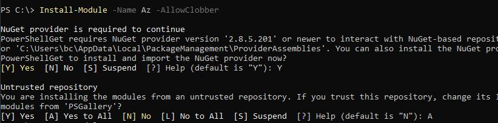
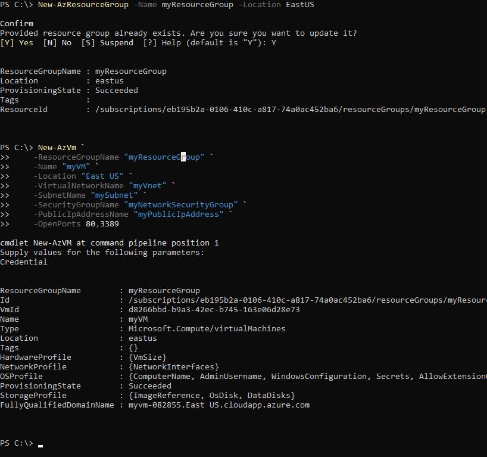
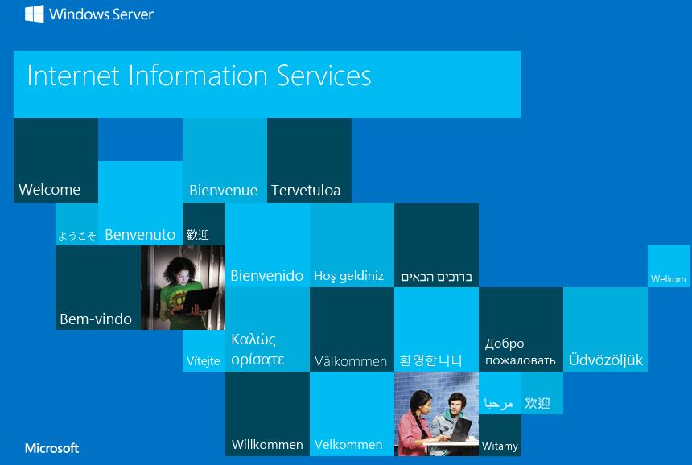
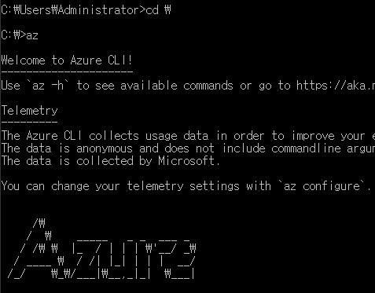
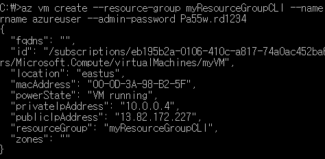
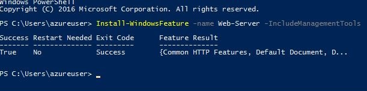

# Azure Shell

## 1. Cloud Shell

* Azure Portal 안에서 사용하는 Shell
* 처음 시작할 때 Storage를 만들어야함
* `>_` 모양으로 된 것
* Shell 의 장점 : 대량 관리 및 자동화 관리할 때 편리함
* Cloud Shell 에서는 PowerShell, Bash, Azure CLI 를 모두 사용할 수 있으며 module 또한 기본적으로 내장되어있어 쉽게 사용할 수 있다.


### a. PowerShell

* Windows에서 사용가능한 쉘
* Azure Resource Group을 Window 환경에서 바로 제어가능함
* 명령어가 길고 복잡함

* PowerShell ISE - Powershell 명령어를 스크립트화 시킬 수 있다.

* Powershell module : Azure를 제어하기위한 Powershell 명령어 들의 집합

* cmd에서 powershell 사용 가능

* cmd 명령어가 powershell 내에서도 동작 가능

```powershell
# 전체 명령어 표시
get-command
get-command > PowerShell_command.txt

# Process Checking
get-process
```


### b. Azure CLI

* Windows, Mac, Linux에서 사용 가능한 쉘
* 다양한 환경에서 사용가능함
* 명령어가 짧고 단순함

But  상황에 따라 다르기 떄문에 결국 둘 다 알아야한다.


## 2. PowerShell 사용

### a. PowerShell 환경 구축

* 일반 Windows내에 Azure를 제어할 수 있는 Module이 내장되어 있지 않으므로 다운로드가 필요하다.

* https://docs.microsoft.com/ko-kr/azure/virtual-machines/windows/quick-create-powershell

  Microsoft Azure Website 에서 상세한 내용을 확인할 수 있다.

```powershell
## Azure Module Download
## .NET Framework 문제로 Window Server 2016에서 설치 실패
## 해결방법 모색중
## Window Server 2019에서는 정상 설치
Install-Module -Name Az -AllowClobber
```



```powershell
## Import Azure Module 
Import-Module Az.Accounts

## Azure Account Connet
Connect-AzAccount
## Sign in Azure

## Subscription ID가 여러개인 경우
Get-AzSubscription ##Subscription Checking
Select-AzSubscription -Subscription <Subscription ID> ## Subscription Sellecting
```


### b. PowerShell 리소스 그룹 생성

```powershell
## VM Microsoft Server 2019 안에서 진행함

# Resource Group 만들기
New-AzResourceGroup -Name myResourceGroup -Location EastUS

# New VM 만들기 # `(빽틱) 은 다음 줄로 연결되도록 하는 것
New-AzVm `
    -ResourceGroupName "myResourceGroup" `
    -Name "myVM" `
    -Location "East US" `
    -VirtualNetworkName "myVnet" `
    -SubnetName "mySubnet" `
    -SecurityGroupName "myNetworkSecurityGroup" `
    -PublicIpAddressName "myPublicIpAddress" `
    -OpenPorts 80,3389
#명령어 -(파라미터) "(파라미터에 들어갈 값)"

## 해당 과정에서 발생되는 계정 생성 과정이 발생됨
## VM에 할당할 계정과 비밀번호를 설정하는 것
```
<설치가 진행 중>


<설치 완료>



```powershell
# IpAddress Checking
Get-AzPublicIpAddress -ResourceGroupName "myResourceGroup" | Select "IpAddress"

# VM 접속
mstsc /v 13.92.228.37
# Resource Group 생성할 때 만든 계정으로 로그인

# Webserver install
Install-WindowsFeature -name Web-Server -IncludeManagementTools

# Remove Resource 리소스가 더이상 필요 없을때 제거
Remove-AzResourceGroup -Name myResourceGroup

```
<Webserver 설치 성공>


<Webserver 구축 후 DNS addr를 통해 들어가면 보이는 첫 화면>




## 3. Azure CLI

#### a. Azure CLI 환경 구축

* https://docs.microsoft.com/ko-kr/cli/azure/install-azure-cli?view=azure-cli-latest 

  URL을 통해 상세한 내용을 찾을 수 있음

* OS환경에 맞는 버전을 설치

* 설치가 완료되면 cmd로 들어간다.

```shell
# Directory C드라이브로 변경
cd \

# Azure CLI 환경 확인
az
```



```shell
az login # Azure Login
az account list # Azure Subscription List

# Subscription을 여러개 가지고 있다면 isDecault : true 설정된 것이 가장 먼저 들어가게된다. 다른 계정을 선택해야할 경우 setting을 진행한다.
az account set --subscription <value of the subscription ID># Subscription setting
```


#### b. Azure CLI 리소스 그룹 생성

```shell
# Resource Group 생성
az group create --name myResourceGroupCLI --location eastus

# Virtual Machine 생성 (구분자 : ^)
az vm create ^
    --resource-group myResourceGroup ^
    --name myVM ^
    --image win2016datacenter ^
    --admin-username azureuser ^
    --admin-password myPassword1234
## username 설정, 원하는 id 설정
## password 설정, password 12자 이상으로 설정
```



#### c. 원격 접속 port 개방

```shell
# 원격 접속을 위한 80번 포트 개방
az vm open-port --port 80 --resource-group myResourceGroup --name myVM

# 원격 접속
mstsc /v 13.82.172.227
## 본인이 만든 VM의 Public IP address를 입력
## 본인의 환경의 방화벽으로 막혀있는 경우 Azure Portal에서 VM의 DNS address를 설정하여 DNS address를 통해 원격접속한다.

```

* 원격 접속한 VM의 Powershell에서 Webserver 설치 

```shell
# Webserver 설치
Install-WindowsFeature -name Web-Server -IncludeManagementTools
```




