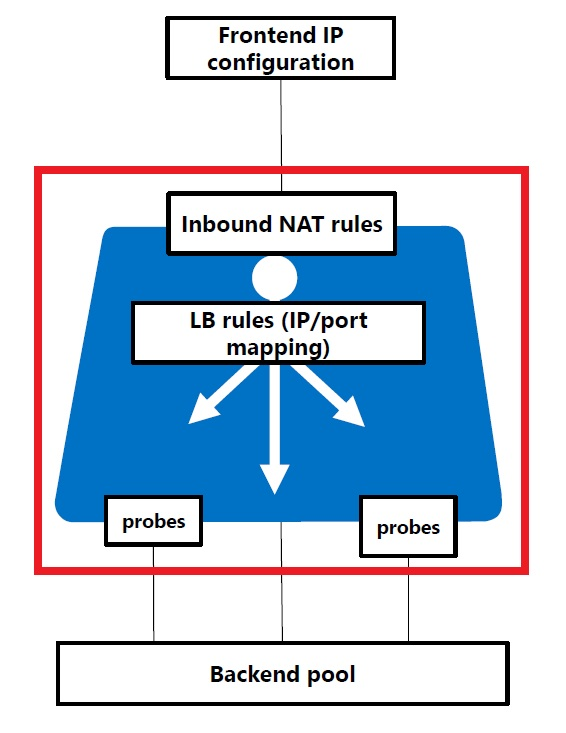
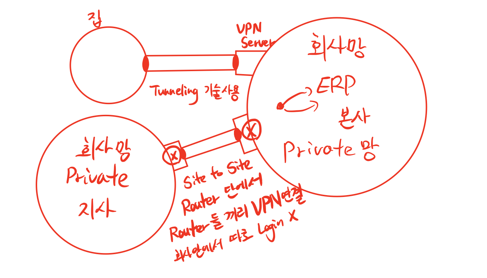
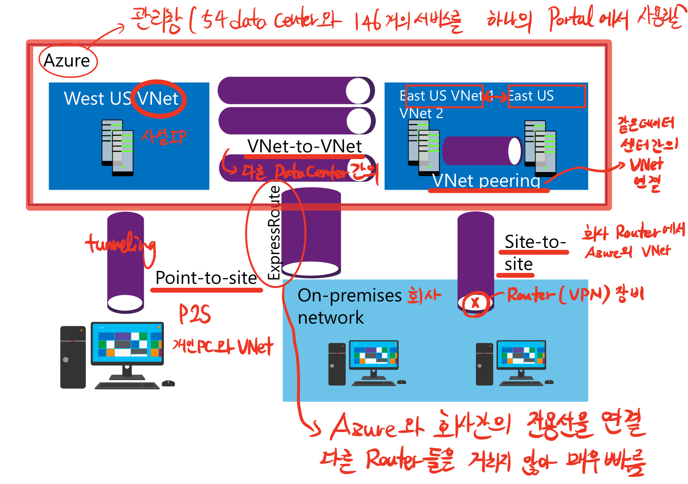

# Introduction to Azure networking (Azure 10979F_05, 20533E_02)

## Lesson 1 

### What are Azure Virtual Networks?

* Logical networking boundary :

  * Automatic but customizable routing

    * Subnet간의 통신은 Router가 반드시 필요하지만

      동일 VNet내의 Subnet은 라우터 없이 통신가능하다. 

      => Automatic Routing

    * 원한다면 라우터를 둘 수 있음. Subnet 간의 보안 강화 등의 기능

  * Built-in but customizable DNS name resolution

    * Azure에서 자동으로 DNS 주소를 만들어준다.
    * 원한다면 개인이 원하는 것으로 설정 가능하다.

  * Support for TCP, DUP, and ICMP

  * Divided into one or more IP subnets

    * 최소 한개 이상의 SubNet으로 구성된다.

* Uses one or more IP address spaces :

  * Private :
    * Based on RFC 1918 :
      * 10.0.0.0 ~ 10.255.255.255
      * 172.16.0.0 ~ 172.31.255.255
      * 192.168.0.0 ~ 192.168.255.255
  * Public

### Determining the need for Azure virtual networks

* VN and Azure resources :
  * Resources that require virtual networks include (VN에 필수적인 리소스) :
    * Azure VMs
    * Virtual machine scale sets
    * Azure Application Gateway (internal)
    * Azure App Service Environment
    * Azure Kubernetes Service
    * Service Fabric
  * Resources that support virtual networks (부수적인 것들):
    * P2S(Point-To-Site) VPN
    * Service Endpoints(ex, Storage, DB, and SQL)
  * Resources that `do not` integrate with virtual networks :
    * Azure AD, Traffic Manager, Content Delivery Network, and Container Registry

### Creating and Configuring Azure virtual networks

* IP subnets:

  * Use 29-bit or larger subnet mask

  * Azure 에서 기본적으로 3개의 IP를 예약함

    * 0번 => Network IP (시작 IP)

    * 255번 => Broadcast IP (끝 IP)

    * 1,2,3 번 => Azure 예약 IP (Network IP 다음의 처음 3개 IP)

    * Example

      10.10.10.0/30 => Host 수 2^2 - 2 = 2개

      But Azure가 3개의 IP를 예약해야 하는데 2개밖에 없으므로 안됨

      10.10.10.0/29 => Host 수 2^3 -2 = 6개

      Azure에서 3개를 예약한 후 사용 가능한 Host IP는 3개

## Lesson 2

### Overview of Azure Load Balancer

* Load Balancer : Layer 4 부하분산장치 

  ​						cf) Layer 7 분산장치 : Application Gateway

* Frontend IP : Client가 접속하는 IP 대역
* Backend pool : Load Balancer가 부하분산 처리할 Pool, Pool 내에서 부하를 분산 처리함
* Probe : Backend Pool에 있는 VM들의 상태를 Check하는 역할
* NAT rules : 공인 IP로 변환해서 내보내는 Rule을 설정
* LB rules : 부하 분산 처리할 IP들을 관리하고 실제 어떤 VM으로 보낼지 결정 및 Mapping

## Lesson 4

### Configuring virtual network connectivity

* Azure virtual network connectivity options

* Configuring P2S VPN connectivity
  
  * Point to Site : 한 대의 PC가 회사망에 Connection 하는 VPN
  
* Configuring a site-to-site VPN

* Configuring a VNet-to-VNet VPN

* Configuring VNet Peering

* Azure : 54개의 data center와 146개의 서비스를 하나의 Portal에서 사용할 수 있도록 하는 관리창

1. P2S VPN : 개인 PC와 VNet 연결
2. Site-to-site VPN : Router 단위의 VPN 연결, 회사의 Router와 Azure VNet 연결
3. VNet peering : 같은 Data Center내에서 VNet끼리 연결
4. VNet-to-VNet VPN : 다른 Data Center의 VNet간의 연결
5. ExpressRoute : Azure와 회사간의 전용선을 연결하여 다른 Router들을 거치지 않고 연결하는 것으로 매우 빠름, 일반적으로 Router를 거쳐서 인터넷 통신하는 것과 대비됨

---

* VPN : Virtual Private Network : 원격에서 터널링 기술을 통해 회사 Network에 접근

 1. PPTP (X)

 2. L2TP / IPsec(암호화하는 기술) : 방화벽 issue 발생가능

 3. SSTP : TCP 443 (SSL) 하나만 열어주면 해당 포트를 통해 연결

 4. IKEv2 : 세션을 서버에서 자동으로 접속

    ​			 이동하며 VPN으로 작업할 경우 session이 계속 끊기고 연결되기를 반복할 수 있음

    ​			 Server에서 자동으로 Client에 재연결하므로 반복해서 재접속을 위해 ID/PW 안 넣어도됨

 

