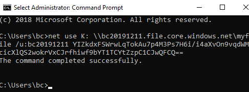
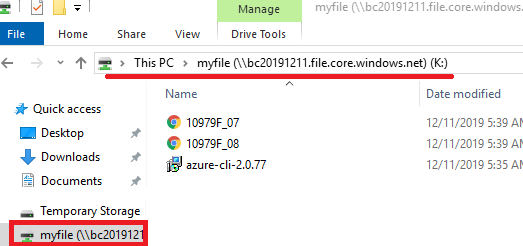

# Azure Storage and SQL

## 1. Azure Storage 환경 구축

* Azure Storage Explorer Download 
  
* https://azure.microsoft.com/ko-kr/features/storage-explorer/
  
* .Net Framework 4.8 문제 발생시

  * https://dotnet.microsoft.com/download/dotnet-framework/net48?utm_source=getdotnet&utm_medium=referral

    Download .Net Framework 4.8 Runtime Download

    프로그램이 동작하기위한 .Net Framework 환경 구축을 위한 것

## 2. Azure SQL 환경구축

* SQL Server Download
  * https://www.microsoft.com/ko-kr/evalcenter/

    SQL Server 선택 후 다운로드

    Server 환경에 SQL을 다운로드해서 Service해야 Server의 모든 장비를 온전히 사용 가능하다.

## 3. Azure Storage Account

### Azure Portal

#### Container

* Azure Portal의 Storage Account에서 Storage Account를 생성하도록 한다.
  * Basic Tap에서 Standard를 선택하면 Storage를 1. Blob Storage, 2. File Storage, 3. Queue Storage, 4. Table Storage를 선택해서 만들 수 있다. Blob Storage는 Container Storage로 이름이 변경되었다. (2019.12.11 확인)
* Containers
  * Storage Account - Containers - `+`Container 또는 New - New Container 생성
    * Public access level : 접근 권한 설정, Anoymous는 Azure account가 없는 익명이 접근 가능하도록 하는 것
    * Container로 설정시 모두 접근 가능
* 생성한 Containers에 원하는 파일 Upload하여 Server의 DB에 파일 저장 가능하며 폴더를 만들어 구분하여 저장 가능
* 저장한 파일을 선택하면 해당 파일을 공유할 수 있는 URL이 새성되어있어 쉽게 공유 가능
* SAS : Shared Access Signiture
* Generate SAS를 통해 특정 시간, 특정 IP등을 제한하여 접근할 수 있는 권한 부여 가능한 token 과 URL을 생성가능

#### File Storage

* Storage Account - File Storage - `+`File or New File을 선택하여 새로운 File sotrage를 생성 - 이름과 Quota를 설정
* GB vs GiB
  * GB : 2진수 계산 - 100GB는 실제로 사용시 대략 98GB
  * GiB : 10진수 계산 - 100GiB는 실제 사용시에도 똑같은 100GB
* Quota : File Storage의 용량을 제한하는 것, 나중에 유동적으로 늘려줄 수 있다.
* Container에서 했던 방법과 동일하게 파일을 Upload할 수 있다.

#### Access keys

* 개발 프로그램에서 SQL DB에 접근하기 위한 Key 값
* 하나의 key가 오류가 발생했을 때의 문제를 방지하기 위해 기본적으로 key1과 key2로 두 개의 key가 존재

### Azure Storage Explorer

* Azure Portal에서 사용하는 것과 마찬가지로 Explorer에서도 DB를 제어할 수 있다.
* 파일 업로드 및 다운로드 가능하다.

#### Storage 동기화

* File Shares의 경우 Storage를 컴퓨터에 동기화 할 수 있다.
* Azure Storage Explorer - File Shares - 생성한 file share 폴더 선택 - Connect VM 버튼을 클릭 
* Example

>net use [drive letter] \\bc20191211.file.core.windows.net\myfile /u:bc20191211 YIZkdxFSWrwLqTokAu7p4M3Ps7H6i/i4aXvOn9vqdWMcicXlQS2wokrVxCJrfhiwf9bYT1TCYtZzpC1CJwQFCQ==
>
>
>
> [driver letter]  : 컴퓨터에서 사용하지 않는 드라이브 중 선택, C나 D 는 기본적으로 사용하고 있는 드라이브이므로 불가능
>
>\\bc20191211.file.core.windows.net\myfile  : Share할 Azure 공유할 계정
>
>YIZkdxFSWrwLqTokAu7p4M3Ps7H6i/i4aXvOn9vqdWMcicXlQS2wokrVxCJrfhiwf9bYT1TCYtZzpC1CJwQFCQ== : 파일 접근 권한의 키 값

* 공유할 컴퓨터의 cmd 창에서 명령어 입력
  * net use K: \\bc20191211.file.core.windows.net\myfile /u:bc20191211 YIZkdxFSWrwLqTokAu7p4M3Ps7H6i/i4aXvOn9vqdWMcicXlQS2wokrVxCJrfhiwf9bYT1TCYtZzpC1CJwQFCQ==
  

< 명령어 입력 >

<VM의 Storage와 연결 완료>

#### 공유포트

* Azure 내에서의 공유포트 설정을 위해서는 SMB통신을 할 수 있게 해주어야 한다.

| 공유포트 열어줄 Port | SMB 3.0 | SMB 2.0 |
| -------------------- | ------- | ------- |
| TCP 445              | O       | O       |
| TCP 139              |         | O       |
| UDP 138              |         | O       |
| UDP 137              |         | O       |

* Azure의 포트 설정은 Resource Group에 들어가 nsg (Network Security Group) resource에 들어가서 열어줄 port를 설정한다.

* TCP 445 Port를 열어준다.

* Server VM -> Server Manager -> Tool -> Computer Management -> Local Users and Group -> User -> 새 계정을 생성한다.
  * Master 계정을 공유해줄 수 없으므로 임시 계정을 생성
* 공유할 폴더 생성하고 임시계정의 접근 권한을 설정해준다. 
  * 폴더 위치는 c:드라이브에 만드는 것이 좋다.
  * 폴더 우클릭 -> properties -> Sharing -> Advance Sharing 에서 폴더 공유 설정
  * Properties -> Security -> 임시 계정이 Security 권한이 있는지 확인, 없다면 Users를 추가해준다.

## 4. SQL

* Azure에서 사용할 수 있는 SQL은 두가지 종류가 있다.

  1. Azure SQL : PaaS => 사용자 DB만을 사용하고 System DB는 MS에서 관리한다.
  2. SQL Database = SQL in an Azure VM : IaaS => System DB와 사용자 DB를 모두 직접 배치 및 관리해야한다.

  