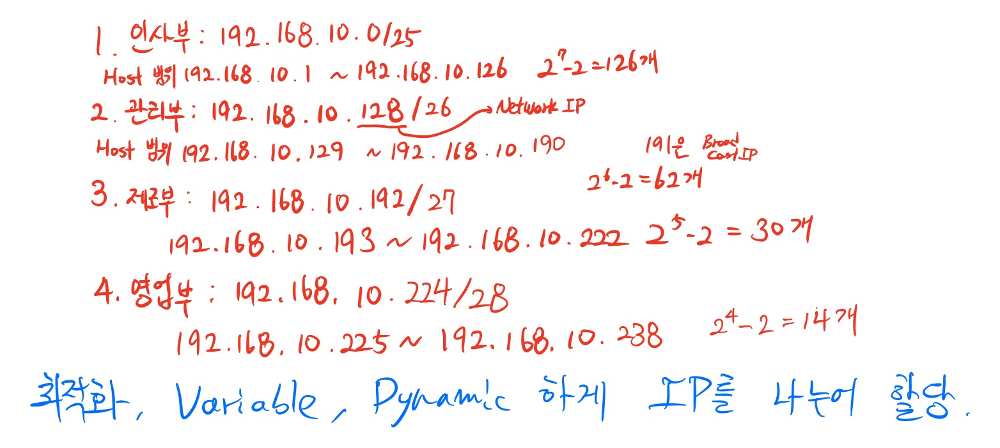

# 종합 

## Cloud

### What is the Cloud Computing?

* Network를 기반으로한 모든 서비스
* 네트워크가 기반이 꼭 되어야한다.
* 웹브라우져 기술이 매우 중요하다.
  * 웹브라우져 : IE, Edge, Safari, Chrome, Firebase, Opera 등
* Cloud Service를 위해서는 Resource들이 Pooling되어있어야한다.
  * Resource : 실제 일하는 HW 장비들
  * Pooling : 여러개의 HW 장비들을 하나로 연결하는 것, Pooling 되어있어야 상단에서 elastic하게 사용가능
  * hyper v : Server 가상화 기술
  * Vset : Storage 가상화 기술
  * NSX : Network 가상화 기술


### Cloud Computing Features

1. Private Cloud : On-Premises에서 제공하는 클라우드 환경
   * 각 회사마다 데이터센터가 존재
   * MS : System Center + Hyper V
   * VMware : Vsphere = vCenter(관리) + ESXI(가상화)
   * OpenStack + Linux / 무료 -> 기술지원 X
2. Public Cloud : IT Vendor에서 제공하는 클라우드 환경
   * 아마존, MS, Google, KT, SKT 등
3. Hybrid Cloud : Private + Public
   * 회사에서 세계적인 행사를 진행할 때, 서버에서 감당이 안되면 Cloud에 올려서 진행한 후 끝나고 나면 다시 회사의 데이터센터로 옮기는 형식

* On-demand : 원하는 서비스를 직접 선택해서 사용할 수 있다.
* Broad Network Access : 네트워크를 통해서 사용한다.
* Lower Operational Expenses
* Resource-Pooling 리소스가 풀링되어있다.

### Service Model

1. IaaS
2. PaaS
3. SaaS


### Availability

* 서비스 가용성이라는 말로 서비스가 끊기지 않고 얼마나 유지될 수 있는지를 의미한다.


## Network

### IP Address

* Private IP
  * 10.x.x.x
  * 172.16.x.x ~ 172.31.x.x
  * 192.168.x.x
* Public IP (supported, but rearely used, should buy the IP)


* SubNet 
  * VNet에는 Address pool을 하나 또는 그 이상의 subnet을 만들어준다.
  * SubNet에 IP를 할당해서 그 ip를 사용하는 것
* DNS name resolution
  * Defalt - Azure에서 기본적으로 제공됨,
  * Custom - 개인 Domain을 구매한 후 넣어줄 수 있음, Active Directory가 매칭되어있어야 한다.
    * Active Directory를 매칭하기위해서 MX record와 TXT record가 할당되있어야한다.

### TCP/IP port

Port : 데이터가 전송 되는 통로 (0 ~ 65,536)

* 0번과 65,536번은 사용하지 않는다.

* 1 ~ 1024 : 잘 알려진 포트

  * TCP 21 : FTP : 파일을 주고 받을 때
  * TCP 22 : SSH        => 원격관리할 때 ->암호와 O
  * TCP 23 : Telent    => 원격관리할 때 ->암호와 X -> 이제 안씀
  * TCP 25 : SMTP : Mail
  * TCP 53 : DNS Zone Trasfer : DNS database를 복제할 때
  * UDP 53 : DNS Name Resolution
  * UDP 67, 68 : DHCP
  * TCP 80 : Http, WebService
  * TCP 443 : Https, WebService with 암호화
  * TCP 445 : SMB 3.0
  * TCP 110 : POP3
  * TCP 1433 : SQL
  * TCP 3389 : RDP(Remote Desktop Protocol) : Window Server 원격 관리, 포트를 직접 열어주어야 함
  * TCP 1025 ~ 5000 : Application

  

### CIDR

* CIDR (Classless Inter-Domain Routing) : Class IP할당의 경우 IP낭비가 심해 2진법으로 더 상세하게 IP를 나누는 방식

  * /23 : 23개의 자리에 subnet mask가 들어가는 것을 표기

* Subnet Mask : Network IP와 Host IP를 구분하는 가늠자 역할

  * Subnet Mask 가 '1' 들어가는 곳 까지가 Network IP

  * Subnet Mask 가 '0' 들어가는 곳 까지가 Host IP

    example : 2000개의 host가 필요한 경우 

    ​					2048 = 2^11 -> 11bit를 Host IP로 할당하면 됨 => 32bits - 11 bits = 21bits

    ​					21개의 bit가 Network IP를 결정하는 곳에 설정되면 됨. 즉 21개의 1이 subnet mask를 구성

    ​					11111111.11111111.11111000.00000000 => 255.255.248.0


### Subnet

* Subnetting : ISP에서 부여받은 네트워크 IP를 더 작은 Sub Network로 분할하여 사용
  * 192.168.20.0/24 를 2개의 Subnetwork 로 분할하시오.
    * ISP에서 부여받은 192.168.20까지는 Network IP이므로 손대지 않는다.
    * 192.168.20 이후의 1개의 bit를 사용하여 0과 1로 구분하여 Network 주소로 사용해주소로 할당
    * 192.168.20.00000000/25  => 192.168.20.0       => Host IP 범위 : 192.168.20.1 ~ 192.168.20.126
    * 192.168.20.100000000/25 => 192.168.20.128 => Host IP 범위 : 192.168.20.129 ~ 192.168.20.254
    * Host IP 모두 0인 경우 Network 식별, 모두 1인 경우 Broadcast IP 이므로 Host IP 범위 2개 빠짐
    * 위의 2개로 Sub Network를구성할 수 있음
  * 위와 같은 방식으로 Subnetwork를 구성하면 일률적인 방식으로 나누게됨으로 효율적이지 않음

* VLSM (Variable Length Subnet Mask)

  * Host 수에 따라 Subnetting

  * Subnet Mask 값이 각각 다르게 부여됨, 자릿수가 다름

  * 반드시 많은 수를 먼저 Subnetting 해야한다. (주의)
  * 192.168.10.0/24 를 100, 60, 10, 30 개로 Subnetting 하는 경우

  


### VPN

* VPN은 일반적으로 Private IP로 구성되어있다.
* VPN 종류
  * Point to Site
  * Site to Site
  * VNet to VNet : 다른 data center 간의
  * VNet peering : 같은 data center 내에서
  * ExpressRoute : 10G 환경까지 올라감
* VPN은 터널링 기술을 사용하며 보안 이슈로 보안이 필수적이다.
  * PPTP : 보안 때문에 안씀
  * L2TP  : 기본적으로 암호화가 안됨
    *  IPsec과 연동해서 사용하므로 L2TP / IPsec 이라고 한다.
    * 여러개의 port를 열어주어야 한다.
  * SSTP : TCP 443 port하나만 사용함 -> SSL을 통해 암호화한다.
  * IKEv2 : 세션이 끊기더라도 서버에서 자동으로 접속하므로 반복해서 재접속하지 않아도 된다.


### ping 명령어

```shell
ping 8.8.8.8
```

* 목적지 컴퓨터의 방화벽이 열려있어야 ping이 접촉하고 돌아온다.
* 핑의 응답이 돌아오기 위해서는 방화벽의 ICMP Protocol이 열려있어야 한다.

---

```shell
wf.msc
```

* 고급 방화벽 접속
* Inbound Rule - New Rule - Custom - All program - ICMPv4 - Customize - Echo Request - Next - Done : 핑응답 줄 수 있게 열어줌

---

```shell
net use 
```

* 네트워크 서버 접속할 떄
* Azure의 공유 폴더 접속할 때
* Azure의 파일 storage 접속할 때

---

```shell
netstat -na
```

* 내 컴퓨터와 어떤 컴퓨터와 연결되었는지 확인
* 목적지 컴퓨터와 통신하는 것 확인

```shell
ipconfig /displaydns # DNS 보는 것
ipconfig /flushdns # RAM에 올라온 dns 전부 삭제

```


## Shell

* Could shell : Azure Portal에서 사용하는 Shell
  * Power Shell과 Bash Shell을 모두 사용할 수 있다.
  * 처음 한번 Storage를 만들어 주어야한다.
  * PowerShell 명령어와 Azure CLI 명령어를 모두 사용할 수 있다.
* PowerShell - Window에서 사용하는 shell
* Azure CLI - 모든 OS에서 사용가능하다.


* Az 모듈 : 최신 Azure의 모듈 (AzureRM 모듈은 구버전)


* PowerShell을 통해 Azure 접속 순서

  1. Az 모듈 설치 : Install-Module -Name Az -Allow Clobber

  2. 모듈 import : import-module Az.Accounts

  3. Azure에 연결 : Connect-AzAccount

  4. Subscription 확인 및 연결 

     ​	: Get-AzSubscription

     ​	: Select-AzSubscription 


* BashShell을 통해 Azure 접속 순서

  1. CLI 모듈 설치 : azure-cli-2.0.63.msi 

  2. Azure 로그인 : az login

  3. Subscription 확인 및 연결

     ​	: az account list # Subscription list를 JSON 형식으로 출력

     ​	: az account set --subscription


### NAT

* Network Address Traslation
* 내부망을 외부망으로 나가기 위해 사설ip를 공인ip로 바꿔주는 것


### LoadBalancer

* layer 4 부하분산장치
* Region별 부하를 분산처리할 수 없음 -> L7 부하분산 처리 가능
* probe : Backend pool의 건강상태를 check하는 장치


### DNS record

* Authentication : 인증, Credential을 확인하는 것
* Authorization : 허가, 인증된 사용자에게 서버의 특정 권한을 주는 것
* Credential : IDentity(ID) + Password 을 통칭해서 이루는 말
* Token : 허가를 받으면 Token이 만들어짐, 인증된 사용자의 SID가 들어감, 
* SID : 계정의 고유 번호, 컴퓨터가 인식하는 이름, 주민번호 정도로 생각하면 됨


* MFA : Multi Factor Authentication : 다중인증


### Docker

3문제 나옴