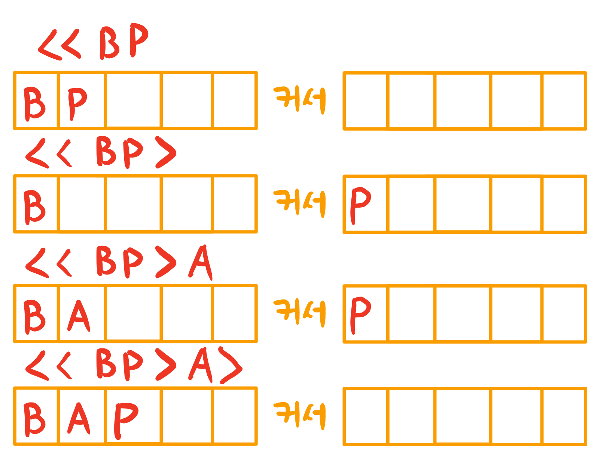

# [파이썬] 백준 5397번 키로거 - 스택 발상의 전환

# 키로거  

| 시간 제한 | 메모리 제한 | 제출  | 정답 | 맞은 사람 | 정답 비율 |
| :-------- | :---------- | :---- | :--- | :-------- | :-------- |
| 1 초      | 256 MB      | 15669 | 3883 | 2452      | 23.480%   |

## 문제

창영이는 강산이의 비밀번호를 훔치기 위해서 강산이가 사용하는 컴퓨터에 키로거를 설치했다. 며칠을 기다린 끝에 창영이는 강산이가 비밀번호 창에 입력하는 글자를 얻어냈다.

키로거는 사용자가 키보드를 누른 명령을 모두 기록한다. 따라서, 강산이가 비밀번호를 입력할 때, 화살표나 백스페이스를 입력해도 정확한 비밀번호를 알아낼 수 있다.

강산이가 비밀번호 창에서 입력한 키가 주어졌을 때, 강산이의 비밀번호를 알아내는 프로그램을 작성하시오.

## 입력

첫째 줄에 테스트 케이스의 개수가 주어진다. 각 테스트 케이스는 한줄로 이루어져 있고, 강산이가 입력한 순서대로 길이가 L인 문자열이 주어진다. (1 ≤ L의 길이 ≤ 1,000,000) 강산이가 백스페이스를 입력했다면, '-'가 주어진다. 이때 커서의 바로 앞에 글자가 존재한다면, 그 글자를 지운다. 화살표의 입력은 '<'와 '>'로 주어진다. 이때는 커서의 위치를 움직일 수 있다면, 왼쪽 또는 오른쪽으로 1만큼 움직인다. 나머지 문자는 비밀번호의 일부이다. 물론, 나중에 백스페이스를 통해서 지울 수는 있다. 만약 커서의 위치가 줄의 마지막이 아니라면, 그 문자를 입력하고, 커서는 오른쪽으로 한 칸 이동한다.

## 출력

각 테스트 케이스에 대해서, 강산이의 비밀번호를 출력한다. 비밀번호의 길이는 항상 0보다 크다.

## 예제 입력 1 복사

```
2
<<BP<A>>Cd-
ThIsIsS3Cr3t
```

## 예제 출력 1 복사

```
BAPC
ThIsIsS3Cr3t
```

## 소스코드

```python
from sys import stdin
for _ in range(int(stdin.readline())):
    typing = stdin.readline().strip()
    left, right = [], []
    for typ in typing:
        if typ == '<':
            if left:
                right.append(left.pop())
        elif typ == '>':
            if right:
                left.append(right.pop())
        elif typ == '-':
            if left:
                left.pop()
        else:
            left.append(typ)
    left.extend(reversed(right))
    print(''.join(left))
```

* 결과
  * 메모리 : 40624 KB
  * 시간 : 1404 ms
  
* 문제 풀이
  * 전체 테스트 케이스가 1,000,000 개의 문자열이 입력될 수 있습니다. 상당히 많은 입력이 예정되어 있으므로 **시간복잡도**를 고려해서 해결하는 것이 관건일 것입니다.
  * 커서의 위치를 `index = 0`으로 둔 다음 앞뒤로 움직일 때마다 앞 뒤로 움직이는 방식으로 진행하는 방식을 가장 먼저 생각할 수 있습니다. 즉, 시뮬레이션 방식입니다. 하지만 그렇게 구현하면 시간 복잡도가 높아져서 시간이 오래걸립니다. 
  * 문자열을 그대로 두고 커서를 움직이는 것 => 일반적인 생각 => 문제가 해결되지 않는다 => 발상의 전환이 필요하다.
  * 커서를 그대로 두고 문자열을 움직이도록 하는 것을 생각할 수 있습니다. 입력된 문자를 리스트에 담도록합니다. 만약 커서를 움직여서 왼쪽으로 이동하게되면 리스트 요소드를 `pop`시킨 후 다른 리스트에 담아 놓으면 됩니다. 즉 커서를 기준으로 양쪽에 리스트가 있다고 생각하면 됩니다.
  * 
  * 위 그림처럼 커서를 왼쪽으로 움직이면 리스트의 요소가 오른쪽 리스트로 옮겨가는 방식입니다.
  * `-`가 입력되면 왼쪽 리스트의 마지막 요소를 제거하면 됩니다.
  * 전체 플로우데로 소스코드를 작성하되 요소가 없는 경우(`pop`을 시킬 수 없는 경우)에 대해서 조건문만 잘 넣어주면 되겠습니다.
  * 리스트 방식으로 사용하면 `insert(0, left.pop())`으로 생각할 수도 있습니다. 아니면, 위의 소스코드처럼 stack방식을 사용해서 그림의 문자`P`를 가장 안쪽까지 넣어주고 연결할 때, `reversed`해주는 방식으로 하면 조금 더 효율적일 것입니다.
  
* 스텍 관련 문제

  * ㄱ

  ㄱ

  * ㄱ

  ㄱ

  * ㄱ

  

* ㄱ


* ㄱ


* ㄱ


* 문제 출처

  * https://www.acmicpc.net/problem/5397
