# [머신러닝] PCA 실습 (2) : 주성분분석이 성능을 높여주는가?

## 실습을 통해서 알아보는 PCA 
주성분 분석이 모델의 성능을 높여줄 수 있는지에 대해서 알아보겠습니다. 데이터셋은 싸이킷 런의 wine 데이터를 사용해서 실습을 진행했습니다. 와인의 알콜 도수, 산도, 색깔, 등의 정보를 바탕으로 어떤 class의 와인인지 알아보는 모델을 LogisticRegression을 사용해서 분류할 것입니다. 이때, PCA를 사용하는 것과 사용하지 않은 것을 두가지를 진행할 것이며 이를 비교해보겠습니다. 
이를 통해서 주성분분석이 필요한 이유와 과연 주성분 분석이 모델의 성능을 높여주는 지에 대해서 알아보겠습니다. 특히나 주성분 분석의 성능 향상에 대해서 여러가지 상황을 나누어 성능 차이를 살펴보도록 하겠습니다.


### 와인 데이터 살펴보기


```python
# 사용한 Library
from sklearn.linear_model import LogisticRegression
from sklearn.metrics import confusion_matrix
from sklearn.model_selection import train_test_split
from sklearn.decomposition import PCA
from sklearn.metrics import accuracy_score
from sklearn import datasets
import pandas as pd
import numpy as np
import matplotlib.pyplot as plt
import seaborn as sns
```


```python
# 와인 데이터 불러오기
data = datasets.load_wine()
X = data.data
y = data.target
feature_names = data.feature_names
print(data.target_names)
print(data.feature_names)
```

결과

    ['class_0' 'class_1' 'class_2']
    ['alcohol', 'malic_acid', 'ash', 'alcalinity_of_ash', 'magnesium', 'total_phenols', 'flavanoids', 'nonflavanoid_phenols', 'proanthocyanins', 'color_intensity', 'hue', 'od280/od315_of_diluted_wines', 'proline']

종속 변수는 `['class_0' 'class_1' 'class_2']`으로 3개의 class로 분류되어있습니다.

독립 변수는 `['alcohol', 'malic_acid', 'ash', 'alcalinity_of_ash', 'magnesium', 'total_phenols', 'flavanoids', 'nonflavanoid_phenols', 'proanthocyanins', 'color_intensity', 'hue', 'od280/od315_of_diluted_wines', 'proline']` 을 총 13개가 있는 것을 확인할 수 있습니다.

기본적으로 결측치가 없는 깔끔한 연습용 데이터셋이므로 전체적인 상태만 확인해 보겠습니다.


```python
# 설명 변수들의 분포를 확인하며 정규성을 띄는지 확인해 봅니다.
dfX = pd.DataFrame(x_train)
dfy = pd.DataFrame(y_train)

for i in range(dfX.shape[1]):
    sns.distplot(dfX[i])
    plt.title(feature_names[i])
    plt.show()
```


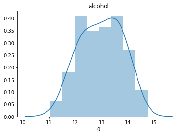


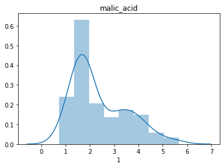


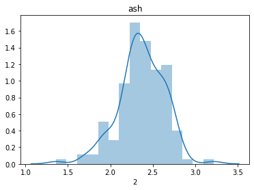


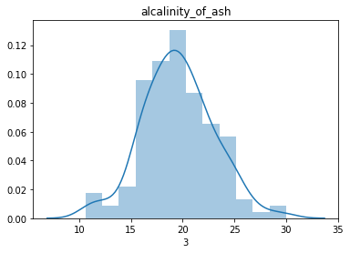


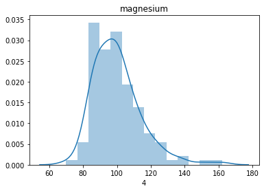


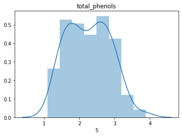


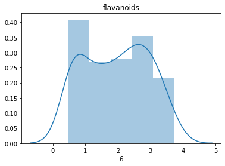


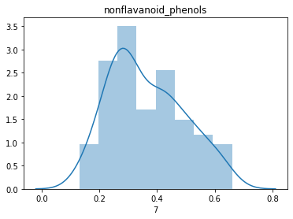


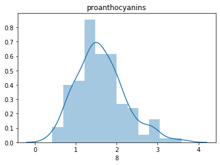


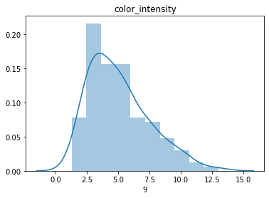


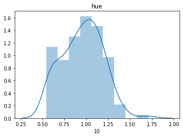


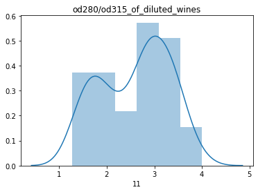


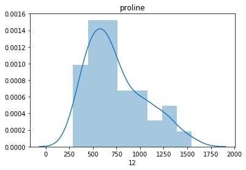


```python
# 종속변수가 골고루 있는지 확인해봅니다.
pd.DataFrame(y)[0].value_counts().plot(kind='bar')
```


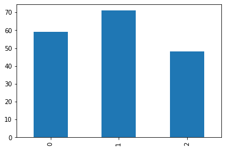


### 로지스틱 회귀 모델 적용

데이터 가공 없이 로지스틱 회귀 모델을 사용해서 모델의 성능을 확인해 보겠습니다.


```python
# Train / Test로 데이터 분류
x_train, x_test, y_train, y_test = train_test_split(X, y, test_size = 0.2, random_state=0)

# 모델 생성 / 최대 iter 2000 / 다중 분류이므로 multi_class 적용
clf = LogisticRegression(max_iter=2000, random_state=0,
                        multi_class='multinomial', 
                        solver='sag')
clf.fit(x_train, y_train)
```

결과


    LogisticRegression(C=1.0, class_weight=None, dual=False, fit_intercept=True,
                       intercept_scaling=1, l1_ratio=None, max_iter=2000,
                       multi_class='multinomial', n_jobs=None, penalty='l2',
                       random_state=0, solver='sag', tol=0.0001, verbose=0,
                       warm_start=False)


```python
# 예측 및 결과 확인
pred = clf.predict(x_test)
print(accuracy_score(y_test, pred))
```

    0.9722222222222222

97%의 정확도를 가지는 것을 확인할 수 있었습니다. 모델 적용 자체는 매우 잘 되는 것으로 생각할 수 있습니다. 데이터셋 자체가 상당히 좋은 데이터이기에 모델의 결과가 굉장히 잘 나오는 것 같습니다. 데이터와 모델을 전반적으로 살펴보았으니 PCA를 적용해보겠습니다.


## PCA(주성분 분석)
전체 데이터 셋에 대해서 주성분 분석을 진행한 후 모델을 적용하여 결과를 확인하고 위의 97%의 모델과 어떤 차이가 있는지 확인해 보겠습니다.


```python
# 모델 생성 및 적용
pca = PCA()
pca.fit(X)

# PC score 구하기
pcscore = pca.transform(X)
```
PC는 새로운 좌표축을, pcscore는 설명력을 가지는 PC 축들에 데이터를 정사영시켜 가지는 새로운 좌표라고 생각하시면 되겠습니다.


각 PC축이 가지는 설명력 정도를 `pca.explained_variance_`를 통해서 알 수 있습니다. 기본적으로 PC 축은 설명력 순서대로 축이 놓여있어서 높은 것들 부터 먼저 보여집니다.

```python
pca.explained_variance_
```

결과


    array([9.92017895e+04, 1.72535266e+02, 9.43811370e+00, 4.99117861e+00,
           1.22884523e+00, 8.41063869e-01, 2.78973523e-01, 1.51381266e-01,
           1.12096765e-01, 7.17026032e-02, 3.75759789e-02, 2.10723661e-02,
           8.20370314e-03])

설명도 정도를 그래프를 통해서 확인해 보겠습니다. 설명정도의 값의 차이가 너무 커서 모두 같은 크기의 막대 그래프가 그려져서 sacle을 log로 설정하였습니다. 첫 번째 PC의 설명도가 상당히 높은 것을 확인할 수 있습니다.


설명도 정도를 비율로 확인할 수도 있습니다. 아래의 그래프를 통해서 각 PC축들이 가지는 설명력을 시각적으로 알 수 있습니다.


```python
PC_ratio = pca.explained_variance_ratio_
PC_ratio_df = pd.DataFrame(PC_ratio)
PC_ratio_df.plot(kind='bar', logy=True, colors='r')
```


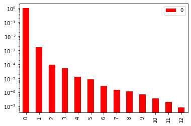


#### 모델 적용 및 비교


```python
clf.fit(x_train, y_train)
pred = clf.predict(x_test)
cf1 = confusion_matrix(y_test, pred)
print(cf1)
print(accuracy_score(y_test, pred))

clf2.fit(train_score, y_train)
pred2 = clf2.predict(test_score)
cf2 = confusion_matrix(y_test, pred2)
print(cf2)
print(accuracy_score(y_test, pred2))
```

    [[13  1  0]
     [ 0 16  0]
     [ 0  0  6]]
    0.9722222222222222
    [[13  1  0]
     [ 0 16  0]
     [ 0  0  6]]
    0.9722222222222222

PCA를 적용한 것과 적용하지 않은 것 모두 97.22%의 정확도를 보여주었습니다. 또한 동일한 confusion matrix를 가지는 것을 통해서 같은 모델이라고 생각할 수 있습니다.  같은 것을 맞추고 같은 것을 틀리는 것입니다. 즉, 모든 feature들을 사용할 경우 pca를 적용한 것과 적용하지 않은 것의 차이가 없는 것으로 생각할 수 있습니다. 


## 모델 생성 및 예측

#### Raw Data Features vs PCA PC score

Train Data와 Test Data를 나누어서 실제 feature들과 PC socre 들 중 어는 것이 더 성능이 좋은지 알아보겠습니다.


```python
# Train / Test로 데이터 분류
x_train, x_test, y_train, y_test = train_test_split(X, y, test_size = 0.2, random_state=0)

# train data만을 가지고 pca 생성
pca = PCA()
pca.fit(x_train)
train_score = pca.transform(x_train)
test_score = pca.transform(x_test)
```

모델 생성


```python
# pca 적용하지 않은 데이터와 적용한 데이터에 
# 동일하게 적용할 로지스틱회귀모델 생성
clf = LogisticRegression(max_iter=2000, random_state=0,
                        multi_class='multinomial', 
                        solver='sag')
clf2 = LogisticRegression(max_iter=2000, random_state=0,
                        multi_class='multinomial', 
                        solver='sag')
```

로지스틱 회귀 모델을 두 데이터에 나누어 넣고 결과를 확인하겠습니다.


#### 2차원 모델

설명 변수를 2개만 사용해서 모델을 생성하고 결과를 확인해 보겠습니다. 2개의 columns만을 사용하기 때문에 설명력이 떨어질 것이고 결과가 좋지 않을 수 있다는 것을 감안하고 진행하겠습니다.


```python
# 2개의 feature만을 사용해서 모델 생성 및 예측

# Raw Data
clf.fit(x_train[:,:2], y_train)
pred = clf.predict(x_test[:,:2])
cf1 = confusion_matrix(y_test, pred)
print(cf1)
print(accuracy_score(y_test, pred))

# PC score
clf2.fit(train_score[:,:2], y_train)
pred2 = clf2.predict(test_score[:,:2])
cf2 = confusion_matrix(y_test, pred2)
print(cf2)
print(accuracy_score(y_test, pred2))
```

    # Raw Data - Confusion Matrix
    [[10  2  2]
     [ 1 13  2]
     [ 3  1  2]]
    # Raw Data - Accuracy score
    0.6944444444444444
    
    # PCA Score - Confusion Matrix
    [[13  0  1]
     [ 0 16  0]
     [ 1  4  1]]
    # PCA Score - Accuracy score
    0.8333333333333334

첫 두개의 feature만을 사용해서 모델을 생성하고 test case를 예측하면 큰 차이를 보이는 것을 확인할 수 있습니다. 기존의 Raw Data의 경우는 약 70%의 정확도를 가지고 PCA 적용 모델은 83%의 정확도를 가지고있습니다. PCA가 더 좋은 성능을 보이고 있습니다.

하지만, pca의 경우 기본적으로 설명력이 높은 순서대로 정렬이 되어있기 때문에 앞쪽의 데이터를 사용하면 설명력 차이로 인해서 pca를 적용한 모델이 높을 수밖에 없습니다. 그러므로 raw_data 모델의 feature들 중에서 2개를 뽑아서 모델을 생성하고 정확도를 모두 살펴보겠습니다. 


```python
# 조합 case를 만들기 위한 library
from itertools import combinations

# 점수들을 모두 담기 위한 빈 리스트
score_board = []

# 순서가 없고 조합되지 않은 모든 케이스에 대해서 모델을 생성하고 결과를 확인
for comb in combinations(list(range(0,x_train.shape[1])),2):
    clf.fit(x_train[:,comb],y_train)
    pred = clf.predict(x_test[:,comb])
    score = accuracy_score(y_test, pred)
    score_board.append(score)
    print(comb)
    print(score)
```

결과

    # Comination
    # Accuracy
    (0, 1)
    0.6944444444444444
    (0, 2)
    0.7222222222222222
    (0, 3)
    0.8055555555555556
    (0, 4)
    0.5555555555555556
    (0, 5)
    0.8888888888888888
    (0, 6)
    0.8333333333333334
    (0, 7)
    0.6944444444444444
    (0, 8)
    0.6944444444444444
    (0, 9)
    0.7777777777777778
    (0, 10)
    0.8611111111111112
    (0, 11)
    0.8333333333333334
    (0, 12)
    0.8333333333333334
    (1, 2)
    0.6388888888888888
    (1, 3)
    0.6388888888888888
    (1, 4)
    0.5277777777777778
    (1, 5)
    0.6666666666666666
    (1, 6)
    0.7222222222222222
    (1, 7)
    0.4444444444444444
    (1, 8)
    0.5277777777777778
    (1, 9)
    0.8055555555555556
    (1, 10)
    0.5555555555555556
    (1, 11)
    0.5555555555555556
    (1, 12)
    0.4722222222222222
    (2, 3)
    0.7222222222222222
    (2, 4)
    0.5
    (2, 5)
    0.75
    (2, 6)
    0.7777777777777778
    (2, 7)
    0.6388888888888888
    (2, 8)
    0.6111111111111112
    (2, 9)
    0.6944444444444444
    (2, 10)
    0.7222222222222222
    (2, 11)
    0.6944444444444444
    (2, 12)
    0.5555555555555556
    (3, 4)
    0.7222222222222222
    (3, 5)
    0.7222222222222222
    (3, 6)
    0.75
    (3, 7)
    0.6388888888888888
    (3, 8)
    0.6388888888888888
    (3, 9)
    0.7777777777777778
    (3, 10)
    0.6666666666666666
    (3, 11)
    0.7222222222222222
    (3, 12)
    0.7222222222222222
    (4, 5)
    0.5555555555555556
    (4, 6)
    0.6388888888888888
    (4, 7)
    0.6944444444444444
    (4, 8)
    0.6111111111111112
    (4, 9)
    0.7222222222222222
    (4, 10)
    0.6944444444444444
    (4, 11)
    0.6666666666666666
    (4, 12)
    0.7222222222222222
    (5, 6)
    0.7222222222222222
    (5, 7)
    0.6388888888888888
    (5, 8)
    0.6388888888888888
    (5, 9)
    0.8333333333333334
    (5, 10)
    0.7222222222222222
    (5, 11)
    0.6944444444444444
    (5, 12)
    0.5555555555555556
    (6, 7)
    0.7222222222222222
    (6, 8)
    0.75
    (6, 9)
    0.8333333333333334
    (6, 10)
    0.7777777777777778
    (6, 11)
    0.7222222222222222
    (6, 12)
    0.4722222222222222
    (7, 8)
    0.5
    (7, 9)
    0.7222222222222222
    (7, 10)
    0.5833333333333334
    (7, 11)
    0.5833333333333334
    (7, 12)
    0.3888888888888889
    (8, 9)
    0.8055555555555556
    (8, 10)
    0.5555555555555556
    (8, 11)
    0.5555555555555556
    (8, 12)
    0.4444444444444444
    (9, 10)
    0.8611111111111112
    (9, 11)
    0.8055555555555556
    (9, 12)
    0.5277777777777778
    (10, 11)
    0.5833333333333334
    (10, 12)
    0.4166666666666667
    (11, 12)
    0.6111111111111112

대부분의 경우가 pca를 적용한 case보다 낮지만 최대치의 경우는 일반 feature 중에서 설명력이 높은 것 2개를 선택해서 모델을 생성한 경우가 가장 효과가 좋은 것을 알 수 있습니다.

```python
# 최대 점수 확인
max(score_board)
```

결과


    0.8888888888888888

최대 점수의 경우는 88.88%의 정확도를 가지고 있습니다. 즉 PCA를 사용한 것보다 더 정확도가 높은 것을 볼 수 있습니다. 


## 결론

  데이터와 feature에 따라서 상황은 다르지만 pca가 더  좋거나 raw_data가 더 좋다고 할 수는 없은 것 같습니다. 현재 자신이 분석하는 데이터와 상황에 따라서 적절하게 맞는 것을 확인해서 사용해야할 것입니다.

  가장 높은 정확도는 raw_Data 중에서 뽑는 것이 도 좋은 결과를 가지고 있습니다. 하지만, 위의 연습용 데이터 처럼 얼마되지않은 데이터의 경우는 큰 문제가 없지만, 현업에서의 아주 큰 데이터와 수백개가 넘는 feature가 있는 경우에는 모든 경우를 확인하기 어려울 것입니다. feature간의 관계를 다 파악하고 어떤 독립변수가 설명력이 높은지 찾는데까지 생각보다 시간이 오래걸릴 수 있습니다.  따라서, feature selection을 통해서 설명력이 높은 feature들을  찾아 뽑아서 사용해야할 것입니다. 

 실제로 데이터가 이런 경우에는 쉽게 pca를 사용하면 설명력이 높은 경우를 바로 뽑아낼 수 있으므로 수많은 column으로 인해 너무 높은 차원의 계산을 낮은 차원으 계산으로 간단하게 줄일 수 있을 것입니다. 아직 데이터사이언스를 공부한지 얼마 되지않아서 짧은 지식이지만 pca 통해서 프로토타입을 제작하고 간략하게 모델을 생성할 때 좋지 않을까라는 생각을 하였습니다.

#### 요약

PCA가 모델의 성능을 높여주는 것은 아니다. 하지만, 빠르게 필요없는 feature들을 없애고 핵심적인 feature 들만을 뽑아서 모델을 만드는 것에는 유용할 것이다.