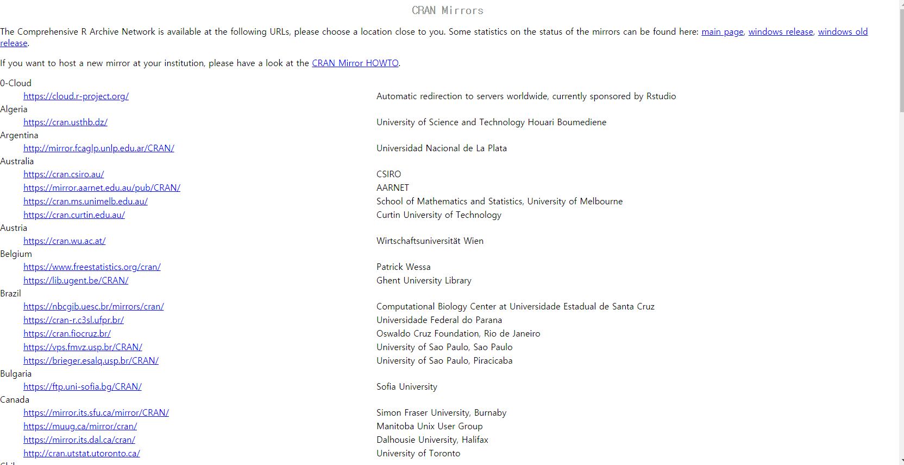
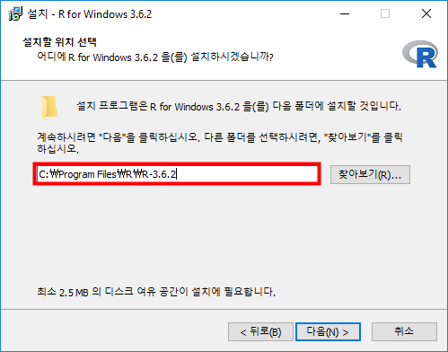
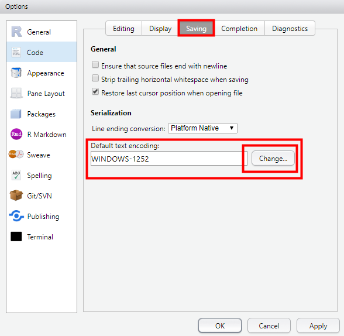

# R과 R Studio 설치하는 방법 및 기본 환경 설정(한글 깨짐 방지, 기본 디렉토리 설정)

### 1. R 이란 ?

R은 통계 컴퓨팅과 그래픽을 위한 무료 소프트웨어 환경입니다. 매우 다양한 유닉스 플랫폼인 윈도우와 맥OS에서 컴파일되고 실행됩니다. 다른 언어들에 비해 조금 유연한 문법으로 사용이 편리합니다. 사용이 매우 쉬워 금방 배울 수 있는 장점을 가지고 있습니다. 특히나 데이터 분석과 시각화 측면에 매우 뛰어납니다. 

### 2. R 설치하기 전 확인사항

R 프로그램을 설치하고 사용하기 위해서는 기본적인 환경 설정이 필요합니다. 

1. 사용자 명이 영어로 되어있는지 확인한다.
2. 컴퓨터 이름이 영어로 되어있는지 확인한다.
3. 폴더 경로가 영어로만 이루어져 있는지 확인한다.

아주 필수적인 내용입니다. 윈도우10을 설치할 때 마이크로소프트 아이디 넣으면 자동으로 컴퓨터 이름을 저의 한글 이름으로 설정해버려서 저도 고생했습니다. 꼭 영어로 구성해주셔야 나중에 오류가 발생하지 않고 사용하실 수 있습니다.

### 3. R 프로그램 설치하기

R 공식 웹사이트로 이동하도록 하겠습니다.

https://www.r-project.org/

다운로드 버튼을 눌러주시면 페이지가 넘어갑니다.

해당 페이지가 나온다면 아래로 내려서 Korea를 찾아줍니다.

Korea 한국 부분에 5개 정도의 다운로드 받을 수 있는 링크가 있습니다. 어떤 링크로 들어가시던 상관없습니다.

본인의 환경에 맞는 곳으로 들어가 주세요.

Intall R for the first time 을 선택해줍니다.

대체 언제 다운로드하나 싶을 수 있습니다. 계속 들어가기만 하는군요. 거의 다 왔어요. 힘내셔요.

드디어 다 왔습니다. Download 버튼을 눌러주면 R 프로그램 다운로드가 시작됩니다.

한글 언어 지원이 되므로 설정해 주시기 바랍니다.

앞에서 말씀드렸던 것과 같이 경로와 폴더명에 한글명이 없도록 꼭 설정해주시기 바랍니다. 

이제 계속 다음을 누르고 진행해주시면 설치가 완료됩니다.

R 설치가 완료되었습니다.

### 4. R Studio 설치하기

R 프로그램을 그냥 사용하기에는 불편한 부분이 있어서 사용하기 편한 script 환경을 위해서 R Studio를 설치해서 사용하시는 것이 좋습니다.

R Studio의 다운로드 경로로 이동하겠습니다.

https://rstudio.com/products/rstudio/download/

해당 경로에 들어간 후 아래 쪽으로 스크롤을 내려주시면 RStudio Desktop 부분이 있습니다. 저는 Desktop 버전으로 다운로드를 진행하였지만, 서버와 연동해서 사용하시는 분들은 Server 버전으로 설치해주시면 되겠습니다.

다운로드파일을 통해서 설치를 진행해주세요. 경로를 기본적으로 되어있는 설정을 사용하시는 것을 추천드리며 영문 경로를 꼭 설정해주세요. 

### 5. R Studio 환경 설정

다운로드가 완료된 R Studio를 실행해주세요.

위와 같은 화면을 확인하셨다면 정상적으로 설치된 것입니다.

Ctrl + Shift + N 또는 왼쪽 상단의 `+`버튼을 눌러 R Script를 눌러주세요. 새로운 Script가 생성될 것입니다. Console에서는 바로 실행되고 코딩하기에 불편하므로 Script에 코드를 작성하고 실행하는 것이 용이합니다.

기본적인 환경구축을 진행하겠습니다.

Tool - Global Options 

해당 경로로 이동해주시기 바랍니다.

General 탭에서 Deault working directory 부분을 확인해주세요. Browse를 눌러 원하는 위치에 기본 workspace를 구성해주세요. 파일이 떠돌아 다니지 않게 R만을 위한 workspace를 지정해주면 좋겠죠?

저는 `C 드라이브`에 `rstudio_bc`라는 폴더를 생성해서 해당 위치를 기본 디렉토리로 설정하였습니다.  ! 주의 ! 폴더명 꼭 영문인 것 기억해주세요.

Encoding 설정을 진행하겠습니다.

Code - Saving - Default text encoding 탭을 확인해주세요. Change를 눌러서 UTF-8을 선택해주세요.

encoding 설정이 완료된 모습입니다. encoding 설정을 바꿔주지 않으면 저장하거나 불러올 때 한글이 모두 깨질 수 있습니다. 꼭 설정을 바꿔주세요.

지금까지 R프로그램과 R Studio를 설치하고 R Studio를 사용하기위한 기본적인 환경설정을 진행하였습니다. 앞으로 R 프로그램을 어떻게 사용하는지에 대해서 알아보겠습니다.