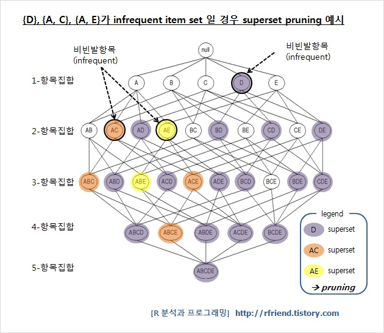

# **연관 분석 Association Analisys**

## **연관 분석이란 **

대용량의 트렌젝션 데이터로부터`X이면 Y이다` 형식의 연관 관계를 발견하여 분석하는 기법이다. 데이터의 발생 빈도에 따라서 각 데이터 간의 연관관계를 알아보는 방법이다.

장바구니 분석을 예로 `기저귀를 샀을 때 맥주를 사는 경우가 많더라` 라는 경우를 들 수 있다.

연관규칙의 대표적인 알고리즘으로 1. Apriori algorithm, 2. DHP Algorithm, 3. FP-growth Algorithm

## **트랜잭션(transaction) 이란?**

기업의 상품의 구매 또는 **일련의 거래와 같은 사건들을 트랜잭션(transaction)** 이라고 한다. 대형마트에 방문하여 물건을 구입하는 손님들중 손님 한명이 산 물품을 트랜잭션 이라고 한다. 대형마트는 데이터베이스를 구축하고 있으며, 수많은 트랜잭션들을 분석하여 의미있는 패턴을 찾아낼 수 있다. 이러한 트랜젝션들을 분석해서 규칙을 발견해 내는 것이 연관분석이다.

## **연관분석 척도**

* 지지도(Support) : 전체 거래 중 항목 X와 Y를 동시에 포함하는 거래의 비율

    

* 신뢰도(Confidence) : 항목 X를 포함한 거래 중에서 항목 X와 항목 Y가 같이 포함될 확률, 조건부 확률과 비슷하다. 연관성 정도를 파악할 수 있다.

    

* 향상도(Lift) : X가 주어지지 않고, Y의 확률에 대한 X가 주어졌을 때의 Y의 확률의 증가 비율

  

## **연관규칙의 장점**

* 탐색적인 기법 : 조건 반응으로 표현되는 연관성분석의 결과를 쉽게 이해할 수 있다.
* 강력한 비목적성 분석기법 : 분석 방향이나 목적이 특별히 없는 경우 목적 변수가 없으므로 유용하게 활용된다.
* 사용이 편리한 분석 데이터의 형태 : 거래내용에 대해 데이터를 변환없이 그 자체로 이용할 수 있는 간단한 자료구조를 갖는다.
* 계산의 용이성 : 분석을 위한 계싼이 상당히 간단하다.

## **연관규칙의 단점**

* 상당한 수의 계산과정 : 품목 수가 증가함에 따라 분석에 필요한 계산의 수가 기하급수적으로 늘어난다.
* 개선하기 위해 유사한 품목을 한 범주로 일반화한다.
   * 연관 규칙의 신뢰도 하한을 새롭게 정의해 실제 드물게 관찰되는 의미가 적은 연관규칙은 제외한다.
* 적절한 품목의 결정 : 너무 세분화한 품목을 갖고 연관성 규칙을 찾으면 의미 없는 분석이 될 수 있다.
   * 적절히 구분되는 큰 범주로 구분해 전체 분석에 포함 시킨 후 , 그 결과 중에서 세부적으로 연관을 찾는 작업을 수행할 수 있다.
* 품목의 비율 차이 : 거래량이 적은 품목은 당연히 포함된 거래 수가 적을 것이고, 규칙 발견 시 제외하기가 쉽다.
   * 이런 경우, 그 품목이 관련성을 살펴보고자 하는 중요한 품목이라면 유사한 품목들과 함께 범주로 구성하는 방법 등을 통해 연관성 규칙의 과정에 포함 시킬 수 있다.

### Pruning : 가지치기

* 빈발항목(자주 발생되는 거래)와 비빈발항목(자주 발생되지 않는 거래)를 구분한다.
* 비빈발(infrequent)에 해당하는 모든 부분 집합에 대한 연산을 제외한다. -> **가지치기(pruning )**
  * AB인 경우가 비빈발인데 AB이면서 C까지 발생하는 경우 ABC 혹은 ABD, ABE, ABCD... 등등 은 당연히 비 빈발항목일 것이다.
  * 따라서 AB가 비빈발로 판단되면 그 아래의 모든 subset들을 모두 계산하지 않는다.
  * 계산 속도를 크게 향상시켜준다.

## **기존 연관성분석의 이슈**

- 대용량 데이터에 대한 연관성 분석이 어렵다.
- 기하 급수적으로 늘어나는 계산 과정으로인해 시간이 많이 걸리거나 시스템 다운되는 현상이 발생한다.

##  **최근 연관성분석 동향**

* 1세대 알고리즘인 Apriori 나 2세대인 FP Tree가 아닌 3세대 FPV를 이용해 메모리를 효율적으로 사용함으로서 SKU레벨의 연관성 분석을 성공적으로 적용

##  **연관성분석 활용방안**

- 장바구니 분석이 경우는 실시간 상품추천을 통한 교차판매에 응용

* 시차분석은 A를 구매한 사람인데 B를 구매하지 않은 경우, B를 추천하는 교차판매 캠페인에 활용
* 다양한 부분에서 활용할 수 있다.

