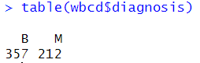

# R 머신러닝 - KNN을 사용한 암, 악성 종양 진단모델

위스콘신대학에서 발행한 암환자 데이터를 바탕으로 종양인지 아닌지를 판단하는 모델을 만들어 보겠습니다. 


사용언어 : R

사용모델 : KNN


```R
library(gmodels) # Crosstable 보기 위한 라이브러리
library(class) # knn이 class 라이브러리에 들어있음

wbcd<- read.csv("C:/rstudio_bc/r/dataset_for_ml/dataset_for_ml/wisc_bc_data.csv", stringsAsFactors = F)

str(wbcd) # 데이터의 구조를 확인
# 환자의 id번호는 종양 발생과 전혀 관련이 없는 특징이므로 해당 부분을 제거
wbcd <- wbcd[-1] # -1 : 1번 열 제거

# 진단 상태 확인
table(wbcd$diagnosis)

```


**진단상태 확인**




B : Benign Tumor : 양성 종양

M : Malignant Tumor : 악성 종양 


569개의 데이터에 37개의 variables이 있습니다. 569개의 환자에 대해서 양성 종양은 357건, 악성 종양은 212건이 있습니다. 


진단 기준으로 factor를 나누고 추가적으로 label을 붙여서 보기 쉽게 하겠습니다.

```R
wbcd$diagnosis <- factor(wbcd$diagnosis, levels = c('B','M'), labels=c('Benign','Malignant'))

# 확률로 비율이 어느정도 되는지 확인
prop.table(table(wbcd$diagnosis))
```


```R
# 임의로 3개의 feature를 뽑아서 데이터를 확인
summary(wbcd[c('radius_mean','area_mean','smoothness_mean')])
```


각 **데이터들의 단위**가 차이가 많아서 그 자체로 사용하기는 어려움이 있습니다. 따라서 데이터들을 **정규화**나 **표준화**가 필요합니다.


### 정규화

```R
# 정규화를 위한 함수
normalize<-function(x){
  return ( (x-min(x)) / (max(x)-min(x)) )
}

# 첫 열은 숫자가 아닌 진단 결과인 문자이므로 제외
# apply함수를 사용해서 wbcd 각 feature들에 정규화 실행
# 이후 데이터프레임 타입으로 변경
wbcd_n <- as.data.frame(lapply(wbcd[2:31],normalize)) 

# train data와 test data로 나눠주자.
wbcd_train <- wbcd_n[1:469,]
wbcd_test <- wbcd_n[470:569,]

wbcd_train_labels <- wbcd[1:469,1]
wbcd_test_labels <- wbcd[470:569,1]

# knn 모델 적용
wbcd_test_pred <- knn(wbcd_train, wbcd_test, wbcd_train_labels ,k=21)

# 정답률 확인
score <- sum(wbcd_test_pred == wbcd_test_labels)
score / length(wbcd_test_pred)
>> 0.98
# 결과 확인하기 
CrossTable(x=wbcd_test_labels, y= wbcd_test_pred, prop.chisq = F )

```


CrossTable을 통해서 결과를 확인할 수 있습니다.

`wbcd_test_pred`에서 Benign으로 판단한 것이 63건이 있는데 그중에서 2건이 Malignant입니다. 나머지 경우에 대해서는 잘 맞았군요. 98%의 정답률이면 꾀 잘나온 것 같습니다.

**However** 오답에 대해서 생각해 보아야 할 것이 있습니다.

실제 상황으로 생각해 보면 양성 종양인데 악성 종양이라고 판단한 경우는 치료해서 나쁠 것은 없습니다. 

반면, 악성종양인데 심각하지 않다 혹은 종양이 아니다 라고 판단하게되면 자칫 심각해질 수 있습니다. 따라서 오답의 경우라도 덜 좋은 오답이라고 생각할 수 있겠습니다.


```R
"""KNN에서 K값에 따른 정답률 변화 확인"""
score_board <- c(1:300) # 빈칸 백터

# K의 값을 1에서 300까지 주면서 정답률 저장
for(i in 1:300){
  wbcd_test_pred <- knn(wbcd_train, wbcd_test, wbcd_train_labels ,k=i)
  true_Value <- sum(wbcd_test_pred == wbcd_test_labels)
  answer_prop <- true_Value / length(wbcd_test_pred)
  score_board[i] <- answer_prop
}

# 데이터프레임으로 타입 변경
df <- as.data.frame(score_board)

# ggplot을 사용해서 변화 추이 시각화
index <- c(1:300)
ggplot(data=df,
       aes(x = index, y = score_board))+geom_line(color='blue', size=1.5)
```


K값이 20대 정도가 정답률이 가장 높은 것을 확인할 수 있습니다. 


### 표준화

표준화는 정규화에 비해 최대 최소 제한된 값이 없기 때문에 중심 방향으로 데이터가 축소되지 않습니다.

표준화를 사용한 결과는 어떻게 나오는지 확인해 보겠습니다. 표준화는 scale함수가 내장되어있어서 바로 적용하면 됩니다.

```R
# 표준화            
wbcd_z <- as.data.frame(scale(wbcd[-1])) # 매우 간단하게 표준화 가능

# train데이터와 test데이터 분류
wbcd_train <- wbcd_z[1:469,]
wbcd_test <- wbcd_z[470:569,]

wbcd_train_labels <- wbcd[1:469,1]
wbcd_test_labels <- wbcd[470:569,1]

# knn모델 적용
wbcd_knn_test <- knn(train = wbcd_train, test = wbcd_test,
                     cl = wbcd_train_labels, k=3)
# 결과 확인
CrossTable(x=wbcd_knn_test, y=wbcd_test_labels)
table(wbcd_knn_test == wbcd_test_labels)

# 점수 확인
score <- sum(wbcd_knn_test == wbcd_test_labels)
score / length(wbcd_test_pred)
```


총 4개의 오답으로 2개는 악성을 양성으로, 2개는 양성을 악성으로 판단하였습니다. 전반적인 정답률은 꽤 높게 나온 것을 확인할 수 있습니다. 이정도면 데이터셋의 질이 좋은 것이라 생각됩니다. 크게 데이터 전처리를 진행하거나 여러가지 모델을 적용하지 않았는데도 결과가 잘 나오는군요.


k의 값에 따른 정답률 변화를 확인해 보겠습니다. 이전 코드와 거의 동일합니다.

```R
score_board <- c(1:300) # 빈칸 백터
# K의 값을 1에서 300까지 주면서 정답률 저장
for(i in 1:300){
  wbcd_knn_test <- knn(wbcd_train, wbcd_test, wbcd_train_labels ,k=i)
  true_Value <- sum(wbcd_knn_test == wbcd_test_labels)
  answer_prop <- true_Value / length(wbcd_knn_test)
  score_board[i] <- answer_prop
}
# 데이터프레임으로 타입 변경
df <- as.data.frame(score_board)
index <- c(1:300)
# ggplot을 사용해서 변화 추이 시각화
ggplot(data=df,
       aes(x = index, y = score_board))+geom_line(color='blue', size=1.5)
```


표준화에서는 K=6일 때 가장 높은 확률이 발생하였습니다.


큰 차이는 없으나 이번 결과에서는 미미하지만 정규화가 표준화보다 정답률이 전반적으로 높게 나오는 것을 확인할 수 있었습니다.