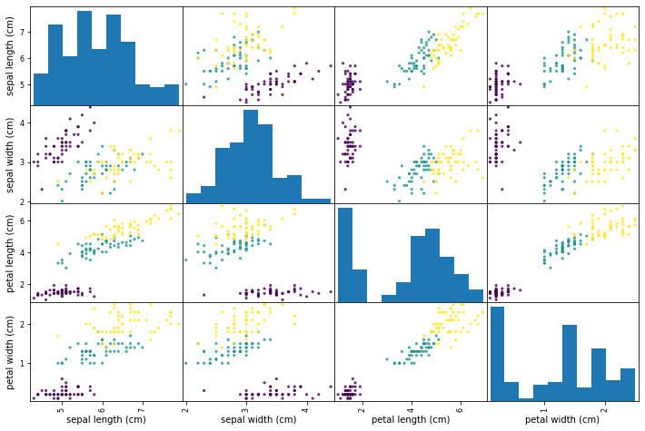
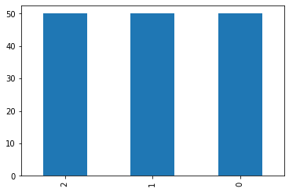
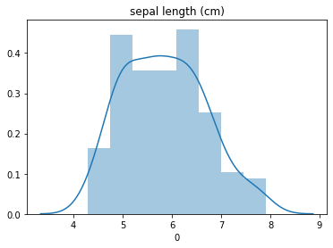
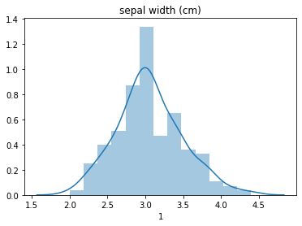
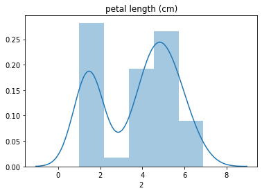
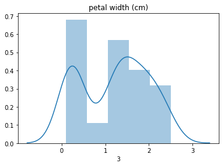
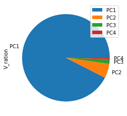
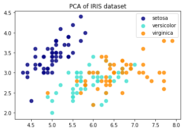

# 실습으로 알아보는 PCA의 필요성

scikit-learn의 IRIS 데이터와 PCA library를 활용해서 PCA실습을 진행하고 왜 PCA가 필요한지 알아보도록 하겠습니다. PCA에 대한 기본 개념의 아래 글을 참고해주세요.

링크

### 사용한 라이브러리


```python
# 기본 데이터 분석을 위한 Library
import pandas as pd
import numpy as np

# 시각화 Library
import matplotlib.pyplot as plt
import seaborn as sns'

# Sklearn에 있는 기본 데이터셋을 가져오기 위한
from sklearn import datasets

# sklearn의 PCA를 통해서 쉽게 PCA 적용가능
from sklearn.decomposition import PCA
# 그렇지 않으면 Matrix만들고 COV 구해서
# eigen_vector, eigen_value를 구해야하는 등 과정이 복잡해진다.
```

IRIS 데이터를 가져온 후 간단하게만 살펴보겠습니다. 파이썬 데이터분석, 머신러닝 등을 공부하는 사람이라면 
기본적으로 IRIS 데이터에 대해서 알고있을 것이라고 생각합니다. 그러므로, 데이터 자체애 대한 설명은 생략하겠습니다.

### 데이터 살펴보기

#### Scatter_matrix 살펴보기

판다스의 scatter_matrix 함수를 사용해서 데이터 전체를 한번에 시각화할 수 있습니다.


```python
from pandas.plotting import scatter_matrix

#loading dataset
iris = datasets.load_iris()
#creating data frame for pandas
dataframe = pd.DataFrame(iris['data'], columns=iris['feature_names'])
scatter_matrix(dataframe, c=iris['target'],marker='o', s=10,alpha=.8, figsize=(12,8))
plt.show()
```





#### Featrue & Target 확인하기

독립 변수와 종속 변수를 확인한다. 
독립 변수가 어느정도 정규분포를 따르는지, 종속 변수 값들이 적절한지 확인합니다.
종속 변수가 99개와 1개 이런 식이면 PCA를 하는 의미가 없습니다.
독립 변수가 min값과 max값 쪽에 몰려있는 식으로 이분화되어있다면 이 또한 그다지 의미가 없으므로 기본적인 데이터의 상태를 확인합니다.


```python
X = iris.data
y = iris.target
feature_names = iris.feature_names

df_X = pd.DataFrame(X)
df_Y = pd.DataFrame(y)
df_Y[0].value_counts().plot(kind='bar')
plt.show()
```




```python
import seaborn as sns
for i in range(df_X.shape[1]):
    sns.distplot(df_X[i])
    plt.title(feature_names[i])
    plt.show()
```













* Target 변수는 0, 1, 2로 범주화되어있습니다. 또한, 150개가 50개씩 고르게 분포하고 있는 것을 확인할 수 있습니다. 
* Features 들은 정규분포에 가까운 그래프를 그려주는 것을 확인할 수 있습니다.


## PCA(주성분 분석 : Principal Component Analysis)

```python
# sklearn을 통해서 PCA 객체 생성 및 PC값을 구할 수 있습니다.
pca = PCA()
pca.fit(X)
PC_score = pca.transform(X)
PC_score[:5]

>>
array([[-2.68412563e+00,  3.19397247e-01, -2.79148276e-02,
        -2.26243707e-03],
       [-2.71414169e+00, -1.77001225e-01, -2.10464272e-01,
        -9.90265503e-02],
       [-2.88899057e+00, -1.44949426e-01,  1.79002563e-02,
        -1.99683897e-02],
       [-2.74534286e+00, -3.18298979e-01,  3.15593736e-02,
         7.55758166e-02],
       [-2.72871654e+00,  3.26754513e-01,  9.00792406e-02,
         6.12585926e-02]])
```

* Transform을 통해서 아주 쉽게 PC값들을 구할 수 있습니다. array 형식으로 각 성분들의 값이 나타나는 것을 확인할 수 있습니다.


```python
# pca의 eigen_vector
pca.components_
```

* pca를 통해 얻은 eigen_vector를 `components_`를 통해서 확인할 수 있습니다. 


    array([[ 0.36138659, -0.08452251,  0.85667061,  0.3582892 ],
           [ 0.65658877,  0.73016143, -0.17337266, -0.07548102],
           [-0.58202985,  0.59791083,  0.07623608,  0.54583143],
           [-0.31548719,  0.3197231 ,  0.47983899, -0.75365743]])


#### PC 값의 설명력 정도

`explained_variacne`를 통해서 PC값 들의 설명 정도를 확인할 수 있습니다.


```python
pca.explained_variance_
```


    array([4.22824171, 0.24267075, 0.0782095 , 0.02383509])

* PC값이 클수록 설명력이 높습니다.

* 첫 번째, PC 값이 가장 크므로 가장 설명력이 높은 축일 것으로 생각할 수 있습니다. 

* 마지막 두개의 PC를 보면 값이 낮습니다. 

* 마지막 값의 경우는 약 170배 정도의 설명력 차이가 나는 것을 알 수 있습니다.  즉, 거의 설명력이 없다고 생각할 수 있겠습니다. -> 그렇다고 전혀 없는것은 아닙니다.

  

explained_variance를 비율로 확인할 수 있습니다.


```python
ratio = pca.explained_variance_ratio_
ratio

>> array([0.92461872, 0.05306648, 0.01710261, 0.00521218])
```

* PC1 이 92%의 설명력을 가지고 PC4가 0.5%의 설명력을 가지고 있습니다.


```python
df_v = pd.DataFrame(ratio, index=['PC1','PC2','PC3','PC4'], columns=['V_ration'])
df_v.plot.pie(y='V_ration')
df_v
```


<div>
<style scoped>
    .dataframe tbody tr th:only-of-type {
        vertical-align: middle;
    }

    .dataframe tbody tr th {
        vertical-align: top;
    }
    
    .dataframe thead th {
        text-align: right;
    }
</style>

<table border="1" class="dataframe">
  <thead>
    <tr style="text-align: right;">
      <th></th>
      <th>V_ration</th>
    </tr>
  </thead>
  <tbody>
    <tr>
      <td>PC1</td>
      <td>0.924619</td>
    </tr>
    <tr>
      <td>PC2</td>
      <td>0.053066</td>
    </tr>
    <tr>
      <td>PC3</td>
      <td>0.017103</td>
    </tr>
    <tr>
      <td>PC4</td>
      <td>0.005212</td>
    </tr>
  </tbody>
</table>
</div>




pie plot 을 통해서 설명력의 정도를 확인해 보았습니다.


### PCA 분석

#### feature에 따른 분포 확인

`X[0]`, `X[1]`을 통해서 IRIS 데이터를 확인해 보았습니다.


```python
plt.figure()
colors = ['navy', 'turquoise', 'darkorange']
lw = 2

for color, i, target_name in zip(colors, [0,1,2] , iris.target_names):
    plt.scatter(X[y == i, 0], X[y == i, 1], color=color, alpha=.8, lw=lw,
                label=target_name)
plt.legend(loc='best', shadow=False, scatterpoints=1)
plt.title('PCA of IRIS dataset')
```




#### PCA를 따른 데이터 분포 확인

PC1, PC2에 의한 분포를 확인해 보겠습니다.


```python
plt.figure()
colors = ['navy', 'turquoise', 'darkorange']
lw = 2

for color, i, target_name in zip(colors, [0,1,2] , iris.target_names):
    plt.scatter(PC_score[y == i, 0], PC_score[y == i, 1], color=color, alpha=.8, lw=lw,
                label=target_name)
plt.legend(loc='best', shadow=False, scatterpoints=1)
plt.title('PCA of IRIS dataset')
```


확실히 이전 scatter plot 보다 데이터들이 좀 더 구분이 잘 되는 것을 볼 수 있습니다.


## LogisticRegression 적용

이번에는 모델을 적용해서 예측된 결과가 어느정도 나오는지를 확인해보겠습니다. 그냥 feature와 PCscore의 차이가 어떻게 되는지 확인해보겠습니다.

```python
from sklearn.linear_model import LogisticRegression
from sklearn.metrics import confusion_matrix
```
4개의  feature와 4개의 PCscore를 모두 사용해서 결과를 확인해 보겠습니다.

#### feature 4개

```python
clf = LogisticRegression(max_iter=1000, random_state=0, 
                        multi_class='multinomial')
clf.fit(X,y)
pred = clf.predict(X)
confusion_matrix(y,pred)

>>
array([[50,  0,  0],
       [ 0, 47,  3],
       [ 0,  1, 49]], dtype=int64)
```

#### PC score 4개


```python
clf.fit(PC_score,y)
pred = clf.predict(PC_score)
confusion_matrix(y,pred)

>>
array([[50,  0,  0],
       [ 0, 47,  3],
       [ 0,  1, 49]], dtype=int64)
```

두 값이 동일한 것을 알 수 있습니다. 모든 feature를 사용했을 때, 설명력이 동일하다고 생각할 수 있겠습니다.
이러한 경우 PCA를 왜 하는지에 대해 의문이들 수 있습니다. 하지만 사용하는 feature의 갯수가 줄어들면 확연하게 차이가 나는 것을 확인할 수 있습니다. 

아래에서는 2개의 feature를 사용해서 LogisticRegression을 진행해서 비교해보겠습니다.

#### feature 2개


```python
clf = LogisticRegression(max_iter=1000, random_state=0, 
                        multi_class='multinomial')
clf.fit(X[:,:2],y)
pred = clf.predict(X[:,:2])
confusion_matrix(y,pred)

>>
array([[50,  0,  0],
       [ 0, 37, 13],
       [ 0, 14, 36]], dtype=int64)
```

#### PC score 2개

```python
clf2 = LogisticRegression(max_iter=1000, random_state=0, 
                        multi_class='multinomial')
clf2.fit(PC_score[:,:2],y)
pred = clf2.predict(PC_score[:,:2])
confusion_matrix(y,pred)

>>
array([[50,  0,  0],
       [ 0, 47,  3],
       [ 0,  2, 48]], dtype=int64)
```

두 결과가 확연하게 차이가 나는 것을 확인할 수 있습니다. 
PC1이 상당히 많은 설명력을 가지고있기 때문에 **PC1과 PC2만으로도 대부분을 분류**할 수 있습니다.
그 덕분에 model의 결과가 상당히 좋게 나온 것을 확인하였습니다. 
반면 그냥 iris.data의 feature의 첫 번째와 두번째는 그다니 설명력이 별로 좋지 못한 것을 확인할 수 있습니다. 이처럼 별 의미없는 변수가 있을 수 있습니다. 실무에서 feature가 매우 많은 경우에는 이러한 것들을 빼고 계산하는 것이 훨씬 편하겠죠.


### 결론

PCA를 함으로써 성능을 높일 수 있다? 는 말은 조금 틀리다고 생각합니다. 어느정도 성능을 유지하면서 연산 속도를 높일 수 있다고 보는 것이 옳은 것 같습니다. feature가 많을 때, 유사한 성능을 보이면서 빠르게 데이터를 분석할 수 있다.

