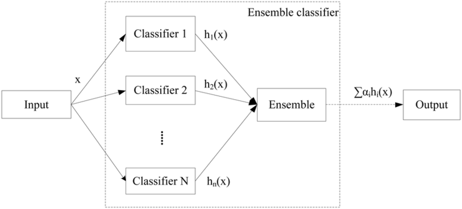

# 앙상블 러닝  Ensemble Learning

일반적인 분야에서는 앙상블 러닝이 잘 사용되지 않을 수 도 있다.

X쪽의 도메인이 더 중요할 수 있음

원인이 더 중요한 경우 어떤 변수가 더 영향을 많이 주는지가 더 중요할 수도 있음

보안같은 분야는 하나라도 놓치면 안되는 분야는 무조건 성능을 높이는 쪾이 더 중요한 경우에는

앙사읍ㄹ 쓰일 수 있음

# Ensemble Learning

* 여러 개의 기본 모델을 활용하여 하나의 새로운 모델을 만들어내는 개념
* 이때의 기본 모델(Base Model)을 weak learner, classifier 등으로 부름

* 대수의 법칙 
  * 큰 모집단에서 무작위로 뽑은 표본의 평균이 전체 모집단의 평균과 가까울 가능성이 높다는 통계적 기본 개념
  * 간단하게 애기하자면 많은 수의 시행, 엄청 많은 반복 시행을 진행하면 이론적 확률 혹은 이성적 판단에 가까워진다는 뜻
  * 예를 들자면, 동전을 10번 던지면 앞면과 뒷면이 5:5가 꼭 나오지 않지만 수백, 수천, 수만번 동전을 던지면 5:5에 매우 가까워진다.
* 다양한 learner를 만들면 전체 모델의 성능이 좋아질 것이다 라는 개념을 base로 한다.
* 여러 개의 기본 모델을 하나의 새로운 모델을 만들어내는 개념

http://blog.naver.com/PostView.nhn?blogId=qbxlvnf11&logNo=221488622777&categoryNo=0&parentCategoryNo=0&viewDate=&currentPage=1&postListTopCurrentPage=1&from=postView

앙상블을 쓰면 성능이 더 좋아지는가?

상당히 좋아짐, 열에 아홉은, 그렇지만 항상 그렇지는 않다.

다양한 의견을 수렴하기 위해서 overfitting이 잘되는 모델을 많이 사용함. 그래서 tree기반의 모델을 basemodel로 많이 사용한다.

Ensemble 개념 자체는 여러 모델의 조합이라는 뜻으로 꼭 tree기반 모델이 아니여도된다.

가장 많이 쓰이는 것은 RandomForest, Boosting은 Tree를 기반으로한 모델이다.

# Ensemble Learning의 종류

## Bagging 

동일한 데이터를 넣으면 같은 결과를 만들기 때문에  모델을 다양하게 만들기 위해서 데이터를 재구성하는 방법

행의 구성을 바꾸는 것

## RandomForest 

모델을 더 다양하게 만들기 위해서 데이터 뿐만 아니라, 변수도 재구성

행 뿐만이 아니라 열 또한 재구성

## Boosting

독립적이지 않고 순서데로 모델을 만들어낸다.

학습 데이터 중에서 잘 맞추지 못하는 데이터에 가중치를 두어 학습을 하는 개념

이러한 학습을 많이 하는 기법

가장 많이 쓰이는 기법 Adaboost, Gradient Boosting

Gradient boosting 이 또 3개로 나뉨

Xgboost, LightGBM, Catboost

## Stacking

모델의 output값을 새로운 독립변수로 사용

0.x % 혹은 0.0x %의 성능을 높이기 위해서 사용하는 방식

상당히 많은 연산량을 필요로하기 때문에 사실 많이 사용하지 않음

여러개의 모델을 결합시키는데, 학습 데이터 내에서 데이터를 분할해서 모델을 만들고 그 output을 새로운 독립 변수로 사용

패키지로 제공되지 않고 코드를 직접 작성해서 만들어야한다.

앙상블의 한 개념이라고 생각하면 된다.

# Bagging

Bagging : 모델을 다양하게 만들기 위해 데이터를 재구성

Bagging : Bootstrap Aggregating

Bootstrap : 복원 추출의 과정 - 중복된 데이터가 입력될 수 있다. + 사용되지 않은 데이터가 있을 수 있다.

전체 데이터들 중에서 통계적으로 63%만 사용된다.

전체 데이터셋을 가지고 복원 축줄을 복원추출한다. 이를 기반으로 decision tree를 만든다. 

oob (out of bag error) : 복원추출하고나면 사용되지 않은 데이터를 검증 데이터로 사용할 수 있다.

oob error를 사용

깊이 성장한 트리는 분산 증가, 편향 감소

bagging : 트리들의 편향을 유지하면서, 분산을 감소시켜 noise에 강건해진다. 대신 모형 해석이 어려워진다.

# RandomForest

Base learner간의 공분산을 줄이고자 데이터 뿐만이 아니라, 변수들도 랜덤하게 뽑아서 다양한 모델을 만드는 것이다. Base Learner들 간의 공분산을 줄이기 위함이다.

뽑을 변수의 수는 hyper parameter이다.  변수 갯수의 루트p개를 사용한다. 혹은 2/3 p 를 사용한다.

일반적으로 Bagging보다 성능이 좋다. 

# Boosting

가장 많이 씌는

* Boosting은 오분류된 데이터에 초점을 맞추어 더 많은 가중치를 주는 방식
* Bagging과 RF는 각 데이터들이 독립이다.
* 하지만 Boosting은 각 round가 종료된 후 가중치와 중요도를 계산하므로 여러개의 모델들이 sequential하게있다.
* 복원 추출시에 가중치를 분포를 고려한다.
* 오분류된 데이터가 가중치를 더 얻게 됨에 따라 다음 round에서 더 많이 사용된다.
* 부스팅 기법으로는 AdaBoost, LPBoost, TotalBoost, BrownBoost, LogitBoost, Gradient Boost 등이 있다.

## Gradient Boosting

분류가 어려운 데이터에 대해서 더 집중적으로 학습시키는 것이 부스팅이다. 

부스팅의 어떻게 가중치를 주는지가 기법의 차이인데

AdaBoost는 오분류된 데이터들에 더 큰 가중치를 주어 다음 round 샘플링에 영향을 준다.

gradient Boosting은  이전 라운드의 데이터의 오류를 예측하는 새로운 약한 분류기를 학습 

오차를 제거하는 것이 gradient boosting

처음 dt에서 발생된 error에 대해서 다음 Decision Tree를 만들어서 오차를 예측함

그에 따른 오차에 대해 예측하는 그 다음의 DT를 만듬

이런 과정을 수없이 반복함.

그러면 어쩔 수 없는 random noise를 제외하고는 예측하는 모델을 만듬

# Gradient Boosting의 종류

## XGBoost

* Kaggle 대회에서 많은 우수한 성적을 나타냄
* XGBoost는 Gradient Boost 개념을 의사결정 나무에 도입한 알고리즘으로 데이터 별 오류를 다음 Round 학습에 반영 시킨다는 측면에서 큰 차이가 없습니다.
* 다만, XGBoost는 학습을 위한 목적식에 Regularization term이 추가되어 모델이 과적합되는 것을 방지해줍니다.
* Regularizaton Term을 통해 XGBoost는 복잡한 모델에 페널티를 부여합니다.
* Gradient Boosting에 비해서 과적합 오류를 방지하기 위해 상대적으로 조금은 덜 복잡한 모델입니다.

## LightGBM

Level-wise growth 방식을 가진 Xgboost와 다르게 Leaf-wise growth 방식을 사용합니다.

Leaf-wise loss를 사용하여 loss를 더 줄일 수 있습니다.

Overfitting에 민감하여, 대량의 학습데이터를 필요로합니다.

더 많은 뿌리를 내릴 수 있어서 분류가 잘된다. 

Xgboost에 비해 2배 이상 빠른 속도를 가지며, GPU를 지원합니다.

## Catboost(unbiased boosting with categorical features)

Categorical feature에 잘 적합하다.

잔차 추정의 분산을 최소화 하면서 bias를 피하는 boosting기법

관측치를 뺀채로 학습해서 그 관측치에 대한 unbiased residual을 구하고 학습하자는 아이디어

Categorical features가 많은 경우 잘 맞는다고 알려져 있음

카테고리 feature를 one-hot encoding 방식이 아닌, 수치형으로 변환하는 방법을 제안하였습니다.

논문에서 제시하는 실험 결과로는 (Catboost > LightGBM > Xgboost)

