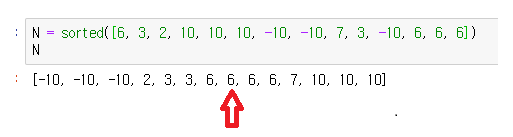
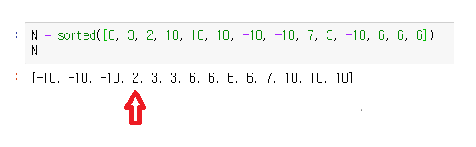

# [Python] 백준 10816번 숫자 카드 2 - 다양한 풀이  이분탐색, 해시, Counter

# 숫자 카드 2 성공

| 시간 제한 | 메모리 제한 | 제출  | 정답 | 맞은 사람 | 정답 비율 |
| :-------- | :---------- | :---- | :--- | :-------- | :-------- |
| 1 초      | 256 MB      | 14702 | 4696 | 3320      | 34.580%   |

## 문제

숫자 카드는 정수 하나가 적혀져 있는 카드이다. 상근이는 숫자 카드 N개를 가지고 있다. 정수 M개가 주어졌을 때, 이 수가 적혀있는 숫자 카드를 상근이가 몇 개 가지고 있는지 구하는 프로그램을 작성하시오.

## 입력

첫째 줄에 상근이가 가지고 있는 숫자 카드의 개수 N(1 ≤ N ≤ 500,000)이가 주어진다. 둘째 줄에는 숫자 카드에 적혀있는 정수가 주어진다. 숫자 카드에 적혀있는 수는 -10,000,000보다 크거나 같고, 10,000,000보다 작거나 같다.

셋째 줄에는 M(1 ≤ M ≤ 500,000)이 주어진다. 넷째 줄에는 상근이가 몇 개 가지고 있는 숫자 카드인지 구해야 할 M개의 정수가 주어지며, 이 수는 공백으로 구분되어져 있다. 이수도 -10,000,000보다 크거나 같고, 10,000,000보다 작거나 같다.

## 출력

첫째 줄에 입력으로 주어진 M개의 수에 대해서, 각 수가 적힌 숫자 카드를 상근이가 몇 개 가지고 있는지를 공백으로 구분해 출력한다.

## 예제 입력 1 복사

```
10
6 3 2 10 10 10 -10 -10 7 3
8
10 9 -5 2 3 4 5 -10
```

## 예제 출력 1 복사

```
3 0 0 1 2 0 0 2
```


# 문제 풀이

문제 풀이와 소스 코드는 제가 문제를 풀어가는 과정 순서대로 작성하였습니다. 가장 빠른 시간을 기록한 결과를 확인하고 싶으면 **가장 마지막**에 있는 소스코드를 확인하시면 되겠습니다.


* 문제 해석
  * 본 문제는 이전의 **수 찾기** 문제와 유사한 것을 확인할 수 있습니다.
    * 해당 링크
  * M 집합에 있는 요소들이 N 집합에 몇 개가 있는치를 출력하는 문제입니다.
  * 시간을 해결하기 위한 문제이므로 단순히 `list`의 메소드인 `count`를 통해서 문제를 해결하는 것은 적절하지 않은 방법일 것입니다.
  * 시간복잡도를 줄이는 핵심 부분은 리스트 N에 요소가 몇개 있는지 숫자를 세는 것입니다.


## 소스코드 01 - 이분 탐색

```python
from sys import stdin
_ = stdin.readline()
N = sorted(map(int,stdin.readline().split()))
_ = stdin.readline()
M = map(int,stdin.readline().split())

def binary(n, N, start, end):
    if start > end:
        return 0
    m = (start+end)//2
    if n == N[m]:
        return N[start:end+1].count(n)
    elif n < N[m]:
        return binary(n, N, start, m-1)
    else:
        return binary(n, N, m+1, end)

n_dic = {}
for n in N:
    start = 0
    end = len(N) - 1
    if n not in n_dic:
        n_dic[n] = binary(n, N, start, end)

print(' '.join(str(n_dic[x]) if x in n_dic else '0' for x in M ))
```

* 결과
  * 메모리 : 126380 KB
  * 시간 : 3620 ms
* 문제 풀이
  * 이분 탐색을 위해서 리스트 N을 순서대로 정렬시켰습니다.
  * 리스트 N에 있는 요소들의 각각이 몇개가 있는지를 `dictionary`에 담아서 저장해놓겠습니다.
  * 이분 탐색을 진행합니다. 
    * N의 요소인 n을 중간 값과 비교합니다.
    * `n != 중간요소` 인 경우 : 탐색 범위를 절반으로 나눈 후 이분 탐색을 계속해서 진행합니다.
    * `n == 중간요소`인 경우 :  start에서 end 까지의 범위에서 `count()` 메소드를 사용해서 몇 개가 있는지를 센 후 return 해줍니다.
  * 이분 탐색 알고리즘을 활용해서 `count` 해야하는 범위를 줄여주는 풀이방법입니다.


## 소스코드 02 - 이분 탐색 활용

```python
from sys import stdin
_ = stdin.readline()
N = sorted(map(int,stdin.readline().split()))
_ = stdin.readline()
M = map(int,stdin.readline().split())

def binary(l, N, start, end):
    if start > end:
        return 0
    m = (start+end)//2
    if l == N[m]:
        i, j = 1, 1
        while m-i >= start:
            if N[m-i] != N[m]:
                break
            else: i += 1
        while m+j <= end:
            if N[m+j] != N[m]:
                break
            else: j += 1
        return i + j - 1
    elif l < N[m]:
        return binary(l, N, start, m-1)
    else:
        return binary(l, N, m+1, end)

n_dic = {}
for n in N:
    start = 0
    end = len(N) - 1
    if n not in n_dic:
        n_dic[n] = binary(n, N, start, end)

print(' '.join(str(n_dic[x]) if x in n_dic else '0' for x in M ))
```

* 결과
  * 메모리 : 125712 KB
  * 시간 : 3400 ms
* 문제 풀이
  * 소스코드 1번의 이분탐색 방법과 유사합니다.
  * 이분 탐색을 진행하다가 중간 요소와 찾는 요소가 같은 경우
    * 리스트 N은 정렬되어있으므로 중간값의 중복 값이 있다면,  해당 인덱스의 앞뒤에 존재할 것입니다.
    * 
    * 위의 그림으로 예를 들어보겠습니다. 6이 찾는 요소라고 하면  6의 앞과 뒤에 중복된 6들이 배치되어 있습니다. 그러므로 `i`와 `j`를 사용해서 중앙에서부터 몇 번째 떨어진 곳 까지 있는지 인덱스를 세어서 6이 몇개가 있는지 확인합니다. 총 몇개의 6이 있는지를 출력합니다.


## 소스코드 03 : 순서대로 숫자 세어 나가기

```python
from sys import stdin
_ = stdin.readline()
N = sorted(map(int,stdin.readline().split()))
_ = stdin.readline()
M = list(map(int,stdin.readline().split()))
index, m_dic = 0, {}

for m in sorted(M):
    cnt = 0
    if m not in m_dic:
        while index < len(N):
            if m == N[index]:
                cnt += 1; index += 1
            elif m > N[index]:
                index += 1
            else: break
        m_dic[m] = cnt

print(' '.join(str(m_dic[m]) for m in M))
```

* 결과

  * 메모리 : 128504 KB
  * 시간 : 1552 ms

* 문제 풀이

  * 두 번째 풀이에서 시간이 크게 줄어들지 않은 것을 확인하였습니다. 따라서 시간을 더욱 단축시키기 위한 방법을 생각하였습니다.

  * 두 번째 문제 풀이의 문제점을 생각해보겠습니다.

    1. 필요한 정보는 M의 요소들에 대한 개수를 알면 되기 때문에 모든 N의 요소들의 숫자를 다 알아줄 필요가 없습니다. 

    2. N의 새로운 요소의 숫자를 셀 때, 전체 리스트에서 이분 탐색을 시작합니다. 하지만, 이미 앞에서 세어주었던 다른 요소들은 확인할 필요가 없으므로 탐색 범위에서 제외하고 싶습니다.

  * 문제점 1번을 생각해서 `sorted(M)`에 해당되는 값만 탐색하도록 하였습니다.

  * 리스트 N과 M을 둘 다 정렬시킨 후 앞에서부터 숫자를 세어나갔습니다. 

  * 

  * 위 그림으로 예시를 들어보겠습니다.

  * -10을 이미 숫자를 센 후 다음 M의 요소가 -5인 경우 N에 없는 것을 바로 확인할 수 있습니다.

  * -10을 이미 숫자를 센 후 다음 M의 요소가  3인 경우 N 탐색 범위가 -10 개를 제외한 `[2, 3, 3, 6, 6, 6, 6, 7, 10, 10, 10]`까지로 줄어들었습니다.  뒤로 갈수록 탐색할 범위가 줄어들 것입니다. 6을 탐색한 이후에는 탐색 범위가 `[7, 10, 10, 10]`이 됩니다.

  * `index`를 하나씩 늘려가면서 숫자를 계속 세어주면 됩니다.


## 소스코드 04 - Hashing 해쉬 알고리즘 방식

```python
from sys import stdin
_ = stdin.readline()
N = map(int,stdin.readline().split())
_ = stdin.readline()
M = map(int,stdin.readline().split())
hashmap = {}
for n in N:
    if n in hashmap:
        hashmap[n] += 1
    else:
        hashmap[n] = 1

print(' '.join(str(hashmap[m]) if m in hashmap else '0' for m in M))
```

* 결과

  * 메모리 : 146276 KB
  * 시간 : 848 ms

* 문제 풀이

  * 해쉬 자료구조의 구현 방식은 `Dictionary`를 많이 사용합니다.
    * hash맵에서 해당 주소에 값이 없으면 값을 추가합니다.
    * hash맵에서 해당 주소에 값이 있으면 그 값에 추가해줍니다.
  * 해쉬 방식을 활용해서 N의 값을 순회하면서 해당 값이 없으면 hashmap에 요소를 추가하고 1을 세어줍니다. 해당 값이 hashmap에 존재하면 숫자를 1씩 늘려줍니다.
  * 모든 N의 요소들을 순회하고나면 hashmap에는 모든 요소들의 숫자가 세어져있습니다.

  


## 소스코드 05 - Collections 라이브러리의 Counter 함수

```python
from sys import stdin
from collections import Counter
_ = stdin.readline()
N = stdin.readline().split()
_ = stdin.readline()
M = stdin.readline().split()

C = Counter(N)
print(' '.join(f'{C[m]}' if m in C else '0' for m in M))
```

* 결과

  * 메모리 : 146276 KB
  * 시간 : 848 ms

* 문제 풀이

  * 소스코드 1~4번은 결국 n의 요소들이 몇개가 있는지를 알기위한 `dictioinary`를 알아내기 위한 노력을 하였습니다. 
  * 하지만, 파이썬에는 이미 해당 요소들이 몇개가 있는지 세어주는 함수가 존재합니다.
  * `from collections import Counter`를 통해서 Counter 메소드를 가져옵니다.
  * 리스트 N을 `Counter`에 넣으면 N의 요소들의 숫자를 센  `Dictionary`자료형이 출력됩니다.
  * `Counter(N)`에 M의 요소가 있다면 해당 숫자를 출력하고 없으면 0을 출력하면 됩니다.

  

  

  

  


* 유사한 문제
* ㄱ


* ㄱ


* ㄱ


* 문제 출처

  * https://www.acmicpc.net/problem/4949

    