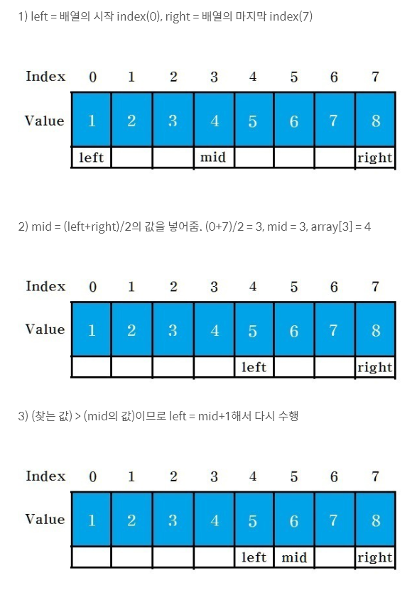

# [Python] 백준 1920번 수 찾기 - 두가지 풀이:이분탐색과 자료형

# 수 찾기

| 시간 제한 | 메모리 제한 | 제출  | 정답  | 맞은 사람 | 정답 비율 |
| :-------- | :---------- | :---- | :---- | :-------- | :-------- |
| 2 초      | 128 MB      | 47591 | 13352 | 8683      | 28.370%   |

## 문제

N개의 정수 A[1], A[2], …, A[N]이 주어져 있을 때, 이 안에 X라는 정수가 존재하는지 알아내는 프로그램을 작성하시오.

## 입력

첫째 줄에 자연수 N(1≤N≤100,000)이 주어진다. 다음 줄에는 N개의 정수 A[1], A[2], …, A[N]이 주어진다. 다음 줄에는 M(1≤M≤100,000)이 주어진다. 다음 줄에는 M개의 수들이 주어지는데, 이 수들이 A안에 존재하는지 알아내면 된다. 모든 정수들의 범위는 int 로 한다.

## 출력

M개의 줄에 답을 출력한다. 존재하면 1을, 존재하지 않으면 0을 출력한다.

## 예제 입력 1 복사

```
5
4 1 5 2 3
5
1 3 7 9 5
```

## 예제 출력 1 복사

```
1
1
0
0
1
```

## 문제 해석

* 간단하게 요약 
  * N개의 정수가 들어있는 집합 A가 있습니다.
  * M개의 정수가 들어있는 집합 B가 있습니다.
  * 집합 B의 요소들이 집합 A에 포함되어있는지 확인합니다.

## 소스코드 1. 이분탐색

```python
from sys import stdin, stdout
n = stdin.readline()
N = sorted(map(int,stdin.readline().split()))
m = stdin.readline()
M = map(int, stdin.readline().split())

def binary(l, N, start, end):
    if start > end:
        return 0
    m = (start+end)//2
    if l == N[m]:
        return 1
    elif l < N[m]:
        return binary(l, N, start, m-1)
    else:
        return binary(l, N, m+1, end)

for l in M:
    start = 0
    end = len(N)-1
    print(binary(l,N,start,end))
```

* 결과 

  * 메모리 : 40596 KB
  * 시간 : 704 ms

* 풀이

  * 이분탐색 알고리즘에 따라서 데이터가 포함되어 있는지 확인하는 풀이방법을 사용했습니다.
    1. 이분 탐색을 위해서 집합 N을 먼저 정렬시켰습니다.
    2. 시작과 끝 지점의 index를 지정합니다.
    3. 시작 인덱스와 끝 인덱스를 사용해서 중간 지점의 인덱스를 구합니다.
    4. 중간 지점의 값과 element를 비교합니다.
       1. 동일한 값이면 찾았다 !
       2. 값이 크다 => 중간보다 윗 부분에서 탐색
       3. 값이 작다 => 중간보다 작은 부분에서 탐색
       4. 위 과정을 확인할 리스트가 없을 때까지 계속해서 반복한다.
    5. 전체 리스트에서 확인이 불가능하면 없는 것으로 판별
  * 이분 탐색의 기본적인 진행은 아래 그림과 같이 진행됩니다.

  

  

  이분탐색에 대해 더 알아보려면 reference : https://dongdd.tistory.com/50 

  

  

## 소스코드 2. 집합 자료형을 통한 포함여부확인

```python
from sys import stdin, stdout
n = stdin.readline()
N = set(stdin.readline().split())
m = stdin.readline()
M = stdin.readline().split()

for l in M:
    stdout.write('1\n') if l in N else stdout.write('0\n')
```

* 결과 
  * 메모리 : 47156 KB
  * 시간 : 145 ms
* 풀이 
  * 소스코드 1 에서 시간이 오래걸리는 부분을 생각하자면 M의 요소가 N에 있는지 확인하는 부분일 것이라고 쉽게 생각할 수 있습니다.
  * 그러므로 이분탐색이 아닌 다른 방법으로 요소의 포함여부를 탐색할 방법을 생각해보았습니다.
  * 리스트가 아닌 다른 자료형들의 시간 복잡도에 대한 부분을 생각해서 해당 부분을 참고하였습니다.
  * https://chancoding.tistory.com/43
  * 자세한 내용은 위 링크
  * 간략하게
    * 리스트의 `in`연산자를 통한 포함 여부의 시간 복잡도는 `O(N)` 입니다.
    * 이분탐색의 시간 복잡도는 `O(logN)` 입니다. 
    * Set과 Dictionary의 `in`연산을 통한 포함 여부 확인의 시간 복잡도는 `O(1)`입니다.
    * 해당 집합에 포함되는지 여부만 확인하면 되므로 Set 자료형을 사용해도 충분합니다.
  * 집합 N을 Set 함수를 사용해서 빠르고 쉽게 M집합의 요소들의 포함 여부를 확인할 수 있습니다.
  * 집합 M의 요소를 순회하면서 집합 N에 포함되면 `1` 아니면 `0`을 출력하도록 해주면 됩니다.
* 유사한 문제
  * ㄱ
  * ㄱ
  * ㄱ
* 문제 출처
  * https://www.acmicpc.net/problem/1920