# Lending club 원금 상환 여부 예측하기(1) : EDA, 데이터 시각화

이번 포스팅을 시작으로 Lending Club의 데이터를 활용해 파이썬 데이터 분석을 진행해볼 예정입니다. 파이썬이 데이터 분석하기에 좋고 강력한 library들도 많이 있습니다. 현재 4차산업양성과정의 빅데이터AI설계 과정을 진행 중입니다. 본 과정을 진행하면서 진행한 프로젝트 중 하나이며, 프로젝트 진행 내용을 정리해서 포스팅하도록 하겠습니다. 

## P2P 대출이란 무엇인가?

P2P (Peer-to-Peer) 대출을 통해 금융기관과 개인의 채무관계가 아닌 개인과 개인간의 채무관계의 대출을 의미합니다. 대부분은 한 명의 개인과 한명의 개인이 아닌 다대 일 관계의 채무관계가 형성됩니다. 

대출 방식은 한명의 채무자에가 여러 채권자들이 조금씩 돈을 투자해서 funding금액을 모와서 대출을 해주는 방식입니다.

P2P 대출의 장점은 까다로운 기관 대출에 비해서 더 쉽고 간편하게 대출할 수 있습니다. 또한, 소액대출에 있어서 카드 신용 대출보다 적은 이자비용이 발생됩니다.

이러한 p2p대출을 위해서 다수의 채권자들에게 돈을 모으는  업, 채무자들의 대출 신청을 받아서 채권자들과 연결해주는 작업 등을 p2p플랫폼이 중간다리 역할을 합니다.

## Lending Club이란

**LendingClub** 은 미국 샌프란시스코에 본사를 둔 미국 P2P 대출 회사입니다. 

자사의 상품을 증권거래위원회(SEC)에 유가증권으로 등록하고 2 차 시장에서 대출 거래를 제공 한 것은 최초의 P2P (Peer-to-Peer) 대출자 였습니다.

LendingClub은 세계 최대의 P2P 대출 플랫폼입니다. 이 회사는 2015 년 12 월 31 일까지 플랫폼을 통해 1,598 억 달러의 대출이 시작되었다고 주장했다.  [출처 : 위키피디아]

LendingClub은 차용자가 $ 1,000에서 $ 40,000 사이의 무담보 개인 대출을 만들 수있게 합니다. 

P2PMarketData의 순위 정보에 의하면 LendingClub은 압도적으로 세계 1위의 규모인 P2P대출 회사입니다. 세계 1위 P2P회사의 데이터를 가지고 채무 이행 여부를 예측하는 모델을 만들어보겠습니다. Kaggle에 들어가면 LendingClub의 데이터를 정리한 파일이 있어서 이 데이터를 활용하였습니다. [https://www.kaggle.com/wendykan/lending-club-loan-data]

 이해

## 데이터 확인

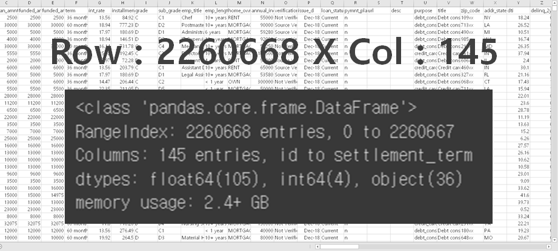

csv 형식의 파일은 226만 행과 145 열로 구성된 데이터입니다. 데이터가 그래도 상당히 큰 편인 것을 알 수 있습니다. 따라서 feature selection 과정이 필요할 것을 예상할 수 있습니다.

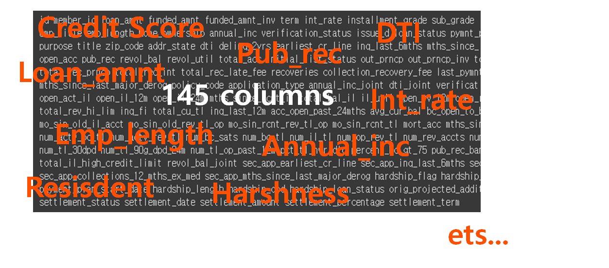

## 결측치 확인

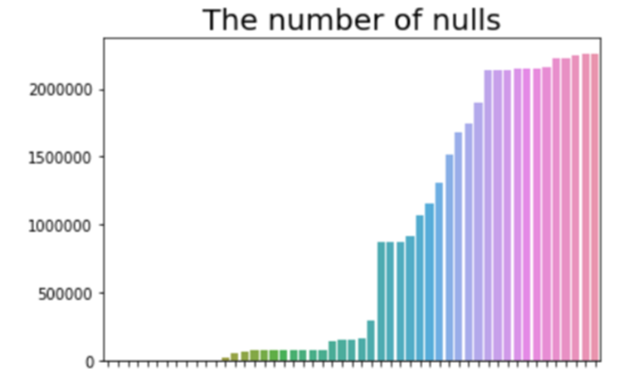

데이터의 결측치를 bar plot으로 확인한 결과입니다. 일부 데이터들의 결측치가 매우 많은 것을 확인할 수 있습니다. 각 feature들의 결측값을 어떻게 채울 것인지에 대한 고민이 필요할 것으로 보입니다.

## Loan Status : 대출 결과 상태 확인

저는 채권자자의 채무 이행여부를 판단하려고 합니다. 즉, ''돈을 값을 것인가?  값지 않을 것인가?'를 예측하려고합니다. 채무 이행과 관련된 `Loan State`열을 살펴보겠습니다.

'Loan State'는 총 9개의 Category로 나누어집니다.

1. Fully Paid => 돈을 다 갚음
2. Current => 현재 대출이 진행중인 대출

3. Charged Off => 감가상각에 들어간 대출 => 즉, 채권자가 채무자에게 돈 받기를 포기한 경우
4. In Grace Period => 유예 기간 => 만료기간이 지나고 아직 연체로 넘어가기 전까지의 기간(한국 사전이나 다른 곳 정의 해놓은 곳 보면 거치기간 등으로 해석해 놓은 것도 있는데 거치기간이랑은 다른 뜻입니다.)
5. Late(16~30 days) => 연체
6. Late(31-120 days) => 연체
7. Default => 파산
8. Does not meet the credit policy : Status Fully Paid  
9. Does not meet the credit policy : Status Charged Off
   * 8번과 9번은 정책이 바뀌면서 현 정책과 맞지 않은 대출건들입니다.

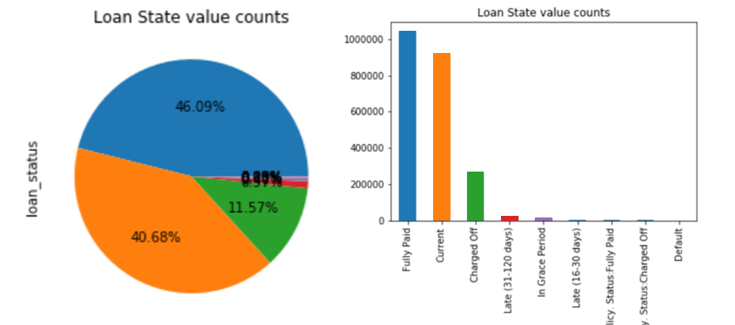

약 40%의 현재 진행중인 대출건이 있습니다. 일부 분석에서는 `Current`상태의 대출을 `Good Loan`으로 분류하는 경우가 있습니다. 저의 경우는 대출을 해준 후, 잘 돈을 갚을 것인지가 궁금한 것이기 때문에 현재 진행 중인 데이터를 결과 데이터로 사용하지 않을 것입니다. 오히려 예측 모델을 잘 만들면 현재 진행중인 대출에 대해서 끝이 `Fully Paid`로 끝날 것인지 `Charged Off`될 것인지를 예측하는 새로운 모델을 만들어 보는 것도 좋을 것 같아 보입니다.

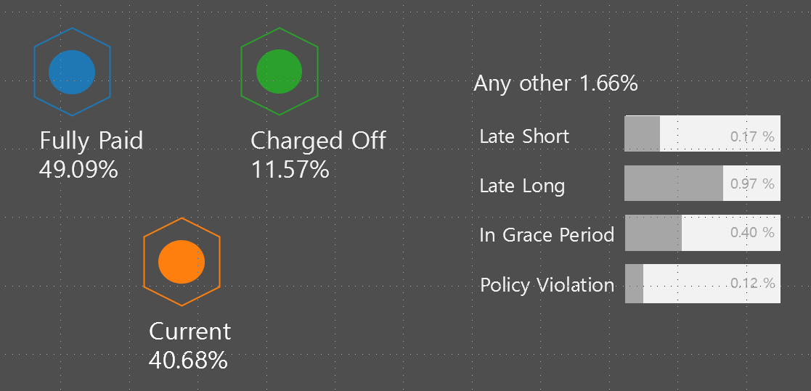

## Target Value

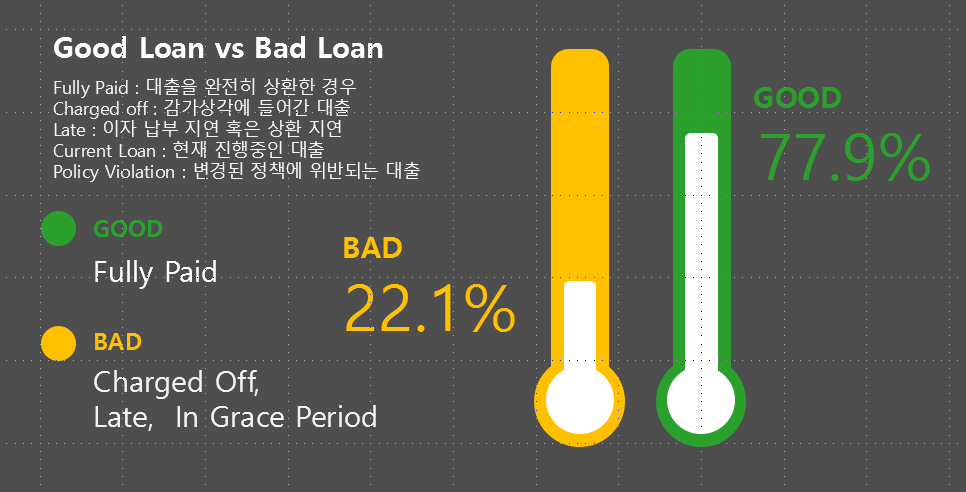

대출이 성공적으로 상환된 `Fully Paid`를 좋은 대출이므로 `Good Loan`으로 설정하였습니다.

`Does not meet the policy`의 경우는 현 정책에 반하는 대출이므로 앞으로 해당되는 대출이 발생되지 않을 것입니다. 따라서, 앞으로의 대출에 적용할 수 없는 케이스이므로 제거하겠습니다.

`Current`는 위 블락에서 설명했던 이유로 제거하겠습니다.

나머지 경우는 모두 채무를 잘 수행하지 못한 경우이므로, `Bad Loan`으로 정의하였습니다.

이렇게 두개의 카테고리로 분류하여 Target Value를 설정하였습니다. 

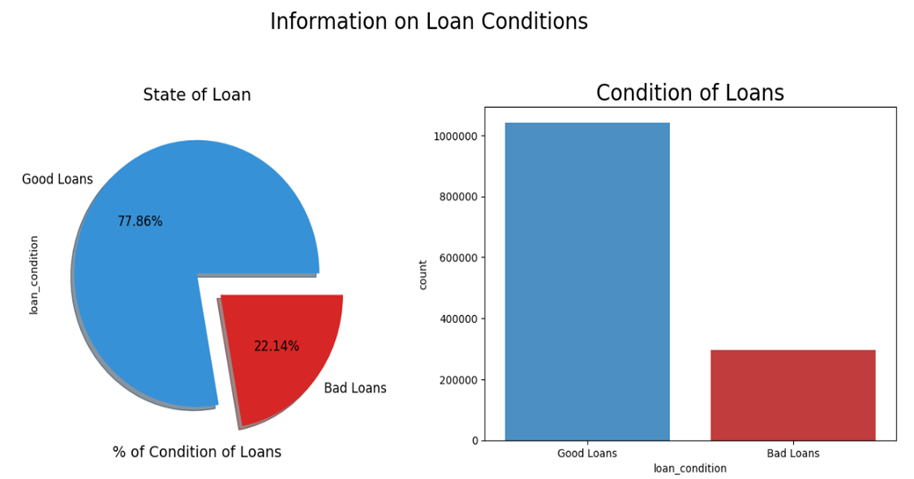

Good Loan과 Bad Loan에 대해서 시각화하여 비교하면 위의 plot과 같습니다. 어느정도 데이터의 불균형이 발생한 것을 확인할 수 있습니다. 해당 부분을 UnderSampling이나 OverSampling을 통해서 비율을 맞추어 줄 것인지를 고민해봐야 할 것입니다.

## 연도별 대출 상태 분석

### 연도별 대출의 비율

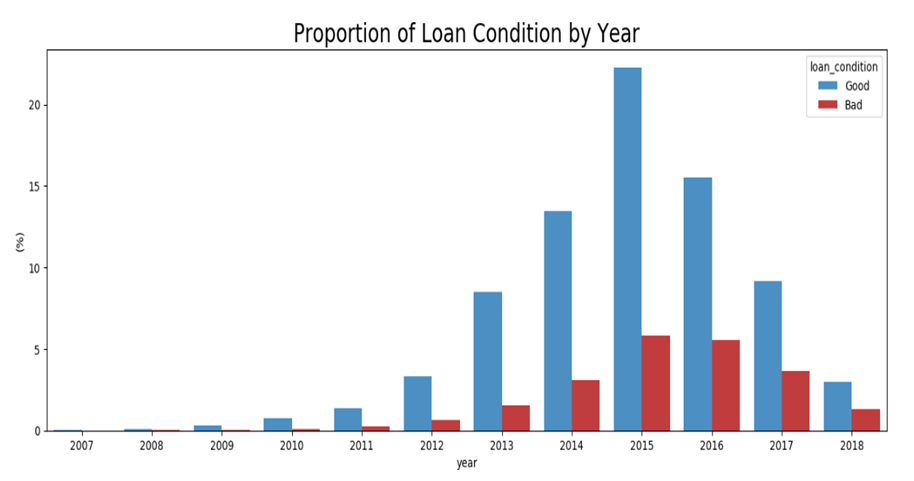

대출이 시행된 연도별로 대출의 상태를 확인하면 위의 그래프와 같습니다. 2016년 부터 비율이 감소하는 이유는 최근 대출일수록 `Current`인 상태의 대출이 많기 때문입니다.

위의 그래프를 통해서 앞으로의 대출 예상 방식을 고민해볼 필요가 있을 것 같습니다. 먼저 전체 데이터를 통해서 예측을 진행하는 방법도 있을 것입니다. 또는, `Current`인 데이터가 없는 연도에 대해서만 타겟해서 데이터를 분석하는 방법도 있겠습니다. 그 이유는 `Current` 대출의 끝 상태를 아직 알 수 없기 때문입니다. 완전히 결과가 나온 연도에 대해서 분석하는 것이 좋을 수도 있겠습니다.

### 연도별 평균 대출 금액

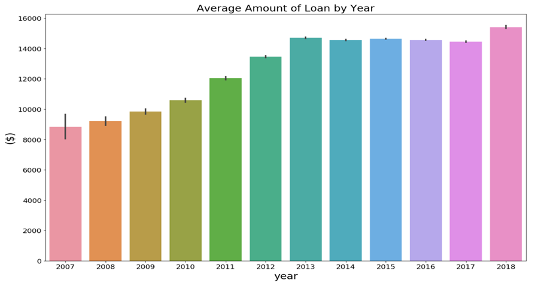

연도별 대출 금액 평균입니다. 연도가 증가함에 따라서 평균 대출 금액이 증가하는 것을 확인할 수 있습니다. 전반적인 물가 상승에 따라서 화폐단위가 커진 것이 큰 역할을 하지 않았나 예상해보았습니다. 또는 전체적인 금리 인하로 시중에 돈이 풀린 것도 있겠습니다. 

## 신용 등급에 따른 분석

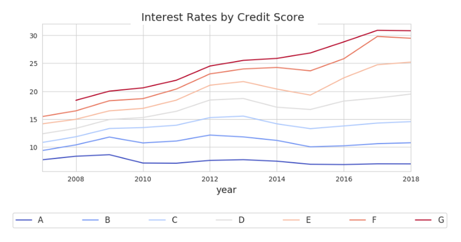

각 신용 등급에 따른 이자 비율을 확인해보았습니다. 신용등급이 낮을 수록 이자 비율이 높은 것을 확인할 수 있습니다. 이를 연도별로 보아도 항상 낮은 신용등급이 더 높은 이자율을 가지는 것을 확인할 수 있습니다.

이 그래프에서 흥미로웠던 것은 연도별로 이자율이 높아지는 것을 확인할 수 있었습니다. 그래서 연도에 따른 평균 이자율을 확인해 보았습니다.

### 대출 상태에 따른 연도별 평균 이자율

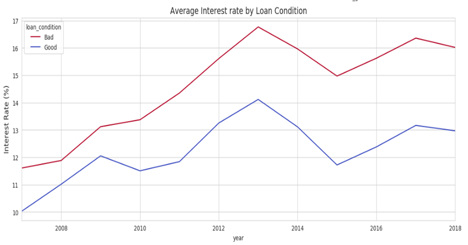

전체적으로 평균 이자율이 높아지는 것을 확인할 수 있습니다. 이자율이 높아진 다는 것이 상당히 흥미로운 부분입니다. 

**25년간의 미국 기준 금리**

미국의 기준 금리를 확인하면 2007년 쯤에 고점에서 2008년에 급격하게 내린 것을 알 수 있습니다. 반면 P2P 대출의 평균 이자율이 2007년에 최저점이고 계속해서 상승 추세인 것을 알 수 있습니다. 금리가 매우 낮아서 기관에서 낮은 이율로 돈을 빌릴 수 있는데 더 높은 비율로 P2P대출을 시행한다는 점에 의문을 가지게되었습니다. 

간단하게 생각할 수 있는 것은 2007년에서 2009년까지는 경제 위기로 인해서 기관에서 대출을 할 수 없었을 확률이 높습니다. 그러므로 높은 금리로 P2P대출을 진행했을 것이라 예측합니다. 하지만 그 이후에 대해서는 사실 잘 모르겠습니다. 해당 부분에 대해서도 더 알아보면 좋을 것 같습니다.

### 신용 등급별 대출 상태의 비율

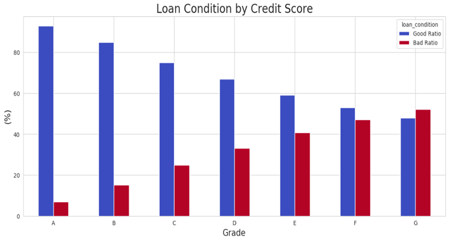

각 신용 등급에 따라 대출 상태의 비율을 확인해 보았습니다. 신용 등급이 높을수록 확실히 대출 상환율이 높은 것을 확인할 수 있습니다.

**세부 신용등급에 따른 대출 상태 비율**

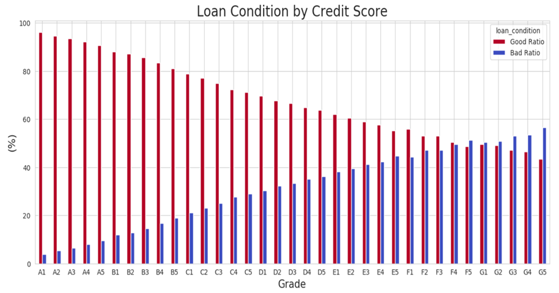

좀 더 상세하게 `sub_grade`(세부 신용등급)에 따라서 비율을 비교해보았습니다. 어느정도 'A등급의 하위보다 B등급의 상위가 더 좋지 않을까?'라는 생각을 해보았지만 전혀 그렇지 않은 것을 확인하였습니다. 세부 신용 등급에 따라서 상환비율이 높은 것을 확인할 수 있습니다. 

### 신용등급별 대출  건수

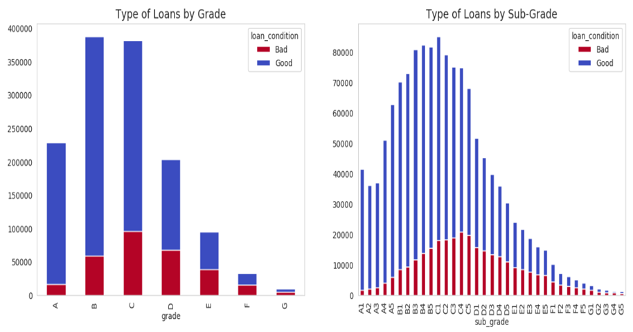

신용등급에 따라서 대출 건수를 비교해보았습니다. 전반적으로 대출하는 경우는 B등급과 C등급의 대출 건수가 가장 많은 것을 확인할 수 있습니다. 대출 건수는 절대적으로 낮은 신용등급 그룹이 훨씬 적은 것을 볼 수 있습니다.

### 신용 등급별 대출 금액 평균

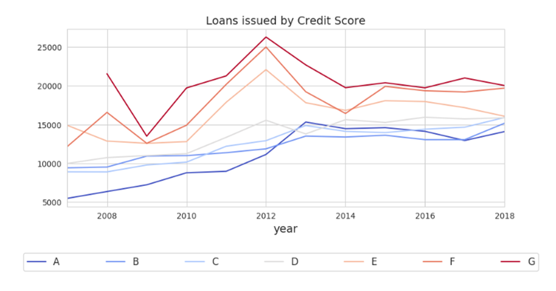

이번 그래프를 통해서 대출 건수 당 대출 평균 대출 금액을 알 수 있습니다. 일반적으로 신용등급이 낮은 등급일수록 상대적으로 많은 금액을 대출하는 경향을 볼 수 있습니다. 대출 건수 자체는 낮은 등급이 훨씬 낮은 것을 이전 그래프에서 확인했었습니다. 반면 대출하는 금액 자체가 높은 것을 확인할 수 있습니다.

이 부분에서 신용등급을 제외하고 대출 금액을 구간을 나누어 대출 금액에 따른 채무 불이행 비율을 알아보는 것도 좋을 것 같다는 생각을 하였습니다.

