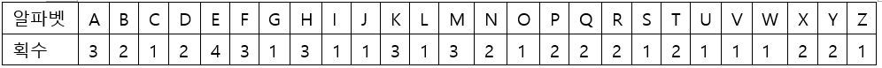
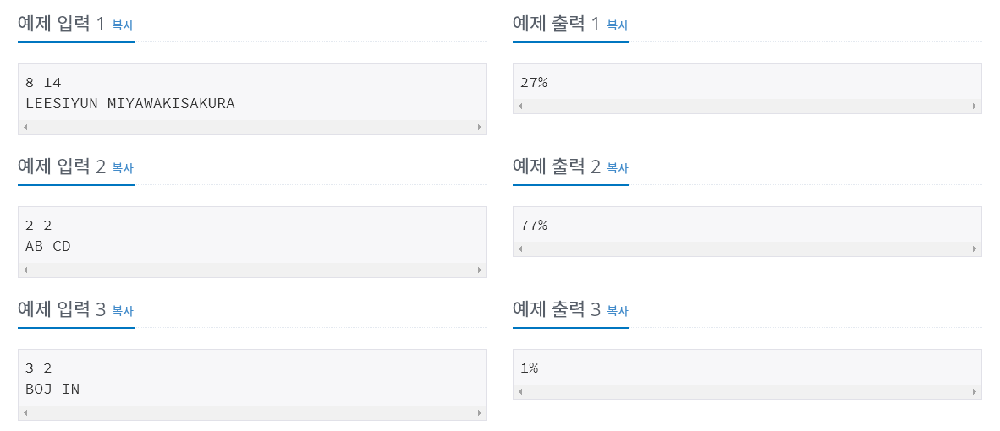
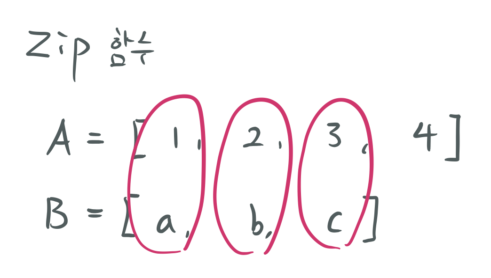
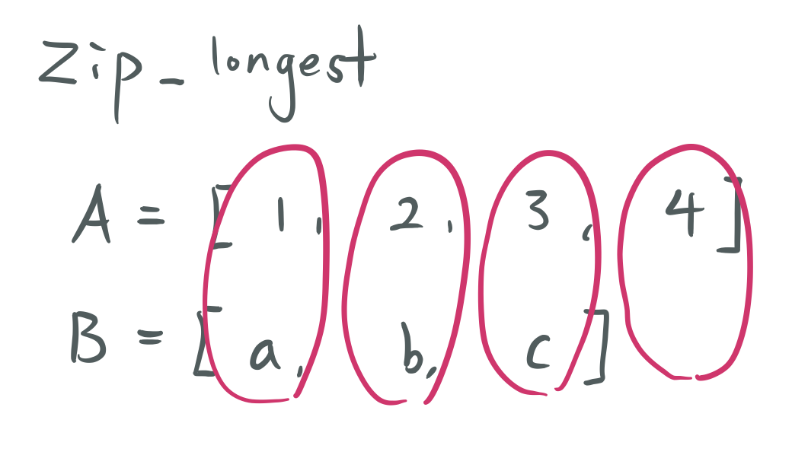

# [파이썬] 백준 17269번 이름궁합 테스트 : itertools 함수 활용

# 이름궁합 테스트 성공

| 시간 제한 | 메모리 제한 | 제출 | 정답 | 맞은 사람 | 정답 비율 |
| :-------- | :---------- | :--- | :--- | :-------- | :-------- |
| 1 초      | 256 MB      | 536  | 332  | 292       | 63.478%   |

## 문제

시윤이는 좋아하는 이성이 생기면 가장 먼저 이름궁합부터 본다. 이름궁합을 보는 방법은 간단하다. 먼저 이름을 알파벳 대문자로 적는다. 각 알파벳 대문자에는 다음과 같이 알파벳을 적는데 필요한 획수가 주어진다. 예를 들어, 두 사람의 이름인 LEESIYUN, MIYAWAKISAKURA 를 같이 표현했을 때 다음과 같이 먼저 주어진 이름부터 한 글자씩 적는다.



두 사람의 이름을 알파벳 대문자로 표현한 뒤, 한 글자씩 번갈아가며 적는다.

예시 :  L M E I E Y S A I W Y A U K N I **S A K U R A**

예시처럼 **이름이 남을 경우엔 뒤에 남은 글자인 S A K U R A를 맨 뒤에 적는다.** 그러고 나서 알파벳을 대응하는 숫자로 바꾸고 각 숫자와 그 숫자의 오른쪽 숫자와 더한 것을 밑에 적는다. 더한 숫자가 10이 넘을 경우엔 일의 자리 수만 남긴다. 이 과정을 반복하여 숫자가 2개만 남았을 때 남은 숫자가 두 사람의 궁합이 좋을 확률이 된다.

```
과정을 자세히 나타내면 다음과 같다.
초기 상태 : 1 3 4 1 4 2 1 3 1 1 2 3 1 3 2 1 1 3 3 1 2 3
한번 수행 :  4 7 5 5 6 3 4 4 2 3 5 4 4 5 3 2 4 6 4 3 5
두번 수행 :   1 2 0 1 9 7 8 6 5 8 9 8 9 8 5 6 0 0 7 8
세번 수행 :    3 2 1 0 6 5 4 1 3 7 7 7 7 3 1 6 0 7 5
...
19번 수행 :                  5 7 0
20번 수행 :                   2 7
따라서 LEESIYUN와 MIYAWAKISAKURA이 궁합이 좋을 확률이 27%이다.
```

## 입력

첫 번째 줄에 이름의 길이 *N*과 *M*을 받는다. (2 ≤ *N*, *M* ≤ 100)

다음 줄에 이름 *A*와 *B*를 입력받는다. 이름은 반드시 알파벳 대문자만 주어진다.

## 출력

*A*와 *B*의 이름궁합이 좋을 확률을 %로 출력한다. 단, 십의 자리가 0일 경우엔 일의 자리만 출력한다.





## 소스코드 01

```python
from sys import stdin
# 알파벳과 획수를 위한 기본 값 설정, 아스키 코드 활용
c = "32124313113132122212111221"
dic = {chr(65+i):int(c[i]) for i in range(26)}

# 기본 입력값 설정
a, b = map(int,stdin.readline().split())
A, B = stdin.readline().split()
# 더 긴 이름 따로 설정하기
long = A if len(A) > len(B) else B
# 최대 최소 저장
n, m = min(a, b), max(a, b)

# 이름 조합을 저장하기 위한 부분
name = []
for i in range(n):
    name.append(A[i]+B[i])
name.append(long[n:]) # 남은 이름 저장하는 부분
name = ''.join(name)

# 알파벳 형태의 이름 조합을 숫자로 변경
# 추가적으로 숫자를 더하는 과정을 1회 실행
lst = []
for i in range(len(name)-1):
    lst.append(dic[name[i]]+dic[name[i+1]])

# 각 숫자를 더하는 과정을 재귀적으로 함수 정의
def calc(lst):
    if len(lst) > 2:
        lst2 = []
        for i in range(len(lst)-1):
            lst2.append((lst[i]+lst[i+1])%10)
        result = calc(lst2)
    else : result = lst
    return result

re = calc(lst)
print(str(re[0]*10 + re[1]) + '%') # 최종 결과 출력
```

* 결과
  * 메모리 : 29284 KB
  * 시간 : 56 ms
* 문제 풀이
  * 구현해야할 부분을 나눠서 생각해 보았습니다.
  * 첫번째, 알파벳에 따른 획수는 정해진 값이므로 dictionary 형태로 key : value 쌍으로 만들었습니다. 아스키코드를 활용하여 순서대로 A to Z까지 획수를 매칭해서 설정합니다. A = 65 부터 순서데로 1씩 증가하면서 Z까지 수행하면 됩니다.
  * 두번째, 이름을 조합하는 부분을 구현해야합니다. 이름을 한 글짜씩 섞어주어야합니다. 그리고 남은 부분을 뒤에 붙여줍니다.
  * 마지막으로 숫자들을 2개만 남을 때 까지 두 숫자를 더해나가는 부분입니다.
  * 한번에 소스코드를 작성하면서 생각나는 방식데로 구현한 결과 위와 같은 소스코드가 작성되었습니다. 좀 더 다듬고 생각하면 더 깔끔하게 소스코드를 작성할 수 있을 것입니다.


## 소스코드 02 : itertools 활용

```python
from sys import stdin
import itertools as z
c = "32124313113132122212111221"
dic = {chr(65+i):int(c[i]) for i in range(26)}
nums = stdin.readline().split()

name = [i for i in z.chain(*z.zip_longest(*stdin.readline().split())) if i]
lst = [dic[i] for i in name]

for i in range(len(name)-2):
    for j in range(len(name)-1-i):
        lst[j] += lst[j+1]

print(str(lst[0]%10 * 10 + lst[1]%10) + '%')
```

* itertools
  * zip 함수와 itertools.zip_longest 함수의 차이
* zip 함수의 예시

```python
A = '1234'
B = '123'
for n in zip(A,B):
    print(n)

>>>
('1', '1')
('2', '2')
('3', '3')
```

* itertools.zip_longest 함수의 예시

```python
import itertools
A = '1234'
B = '123'
for n in itertools.zip_longest(A,B):
    print(n)

>>>
('1', '1')
('2', '2')
('3', '3')
('4', None)
```

* 

* 

* 위의 결과를 보면 쉽게 구분할 수 있습니다. zip함수는 더 짧은 쪽에 맞춰서 짝을 지어줍니다. 반면 zip_longest는 이름처럼 더 긴쪽에 맞춰서 짝을 이뤄줍니다. 본 문제에서는 모든 이름의 철자를 다 사용해야하므로 zip_longest함수를 활용하면 좋습니다.

* itertools.chain 함수 

  * chain 함수는 앞에서부터 하나씩 출력해주는 함수입니다. 

    

* 문제 풀이 2
  * `itertools`를 활용한 문제풀이와 함수를 작성하지 않고 문제를 해결하는 방식으로 수정하였습니다. 조금만 더 깊게 생각하면 깔끔하게 문제를 해결할 수 있습니다.
  * `itertools`의 `zip_longest` 함수를 사용해서 이름을 `input`으로 받으면서 바로 글자를 한글자씩 연결해줍니다. 이 후, `chain`함수를 사용해서 한 글자씩 출력하되 `if`문을 통해서 짧은 이름의 경우 `None`이 출력되는 경우를 제외해줍니다.


* 문제 출처

  * https://www.acmicpc.net/problem/17269

    